## Билет 2

### Структура JSF

- JSP или XHTML-страницы, содержащие компоненты GUI. 

Странички, на котрых физически находится разметка. 
То, что мы скомпоновали в виде View. JSP для старых версий, да и сейчас можно, но зачем? Лучше Facelets шаблоны.
На этих самых JSP или XHTML у нас расположены компоненты (раскиданы, иерархически вложены друг в друга и так далее)
XHTML = XML + HTML

- Библиотеки тегов.

Те самые библиотеки, внутри которых лежат доступные нам компоненты. Есть стандартные библиотеки, входящие в комплект поставки любой реализации JSF, а есть различные библиотеки компонентов (дополнительные) IceFaces, PrimeFaces и т.д., которые можно подключить, чтобы увеличить набор доступных тегов (ну и возможности)

Набор тегов = namespace 
Префикс может быть любым

- Управляемые бины.

Ими управляет веб-контейнер через JSF Runtime. 

Класс (приватные поля, публичные геттеры, сеттеры) , который хранит в себе состояние JSF приложения 

свойство = поле + геттер/сеттер

Управляемые бины – классы, содержащие параметры и методы для обработки данных с компонентов. Должны иметь методы get и set/ Используются для обработки UI и валидации данных. Жихненным цикллом управляет JSF Runtime Env. Доступ из JSP-страниц осуществляется с помощью языка выражений (EL). Конфигурация задается либо в faces-config.xml, либо с помощью аннотаций.

- Дополнительные объекты (компоненты,
конвертеры и валидаторы).

Компоненты - кубики, которые едины в двух лицах: с одной стороны, кусочек html (кнопочка, input), а с другой, java код, который занимается обработкой всего этого дела на серверной стороне. Компоненты могут быть простые (input, button), а могут быть сложными (primefaces компонент google карт ?). Все компоненты реализуют базовый интерфейс UIComponent. Можно создаваь собственные компоненты (но это сложнее, чем в React). На странице компоненты объедиены в древовидную структуру - представление.
Это иерархическое предствление, есть корневой элемент - UIViewRoot 

- Дополнительные теги.

PrimeFaces/RichFaces/IceFaces являются компонентами/JSF-библиотеками, которые вы можете использовать поверх JSF

RichFaces: это библиотека компонентов с поддержкой Ajax с открытым исходным кодом для JavaServer Faces

ICEfaces: open-source, Java JSF расширение и богатые компоненты, Ajax без JavaScript

PrimeFaces: Структура Ajax с компонентами JSF

- Дескриптор развёртывания — web.xml.

JSF фактически в плане реализации это обычное Java EE-шное приложение. JSF - Application Java EE, которая представляет собой надстройку над Java EE в виде Runtime для JSF компонентов.

Для JSF в силу того, что это обычное веб-приложение на базе сервлетов, применима схема с дескриптором развертывания. Он использует обычный Java EE-шный дескриптор развертывания web.xml, который им управляет

- Конфигурация — faces-confg.xml (опционально).

В силу того, что у JSF есть собственный RunTime, у него есть и собственный дескриптор. Опционален, так как можно юзать аннотации. Но конфигурационный файл .xml имеет больший приоритет.

### Наследование и полиморфизм в ORM

<a name="orm"></a> 

При объектно-реляционном отображении наследование и полиморфизм тесно связаны.

Понятия наследования в реляционной модели нет, нужно как-то выкручиваться

Три способа реализации:
1. Одна таблица для всех классов. (Тоже используется, когда преформанс критичен)

    Плюсы: простота и производительность (чем меньше связей на уровне реляционной модели, тем быстрее все работает)

    Минусы: отсутствие null ограничений (в одной и той же таблице физически храянтся несколько сущностей. Мы не можем обозначить not null поля BankAccount (даже если они есть всегда), так как у CreditCard не будет никогда полей BankAccount), не нормализованная таблица
    
2. Своя таблица на каждый класс

    Плюсы: возможность not null ограничений (Все поля, которые есть в классе есть и в сущности)
    
    Работает быстро? Все однородные объекты хранятся в своей табличке

    Минусы: плохая поддержка полиморфных записей (неудобно агрегировать данными по BillingDetails(предок), так как они физически по разным таблицам разложены, таблицы друг с другом на уровне реляционной механики не связаны) , не нормализованная таблица (держим данные одной и той же сущности(предок) в разных таблицах), низкая производительность (работаем внутри сущности - все ок, что касается класса предка - проблемы с перформансом)

3. Своя таблица на каждый подкласс (Чаще всего используется)

    Плюсы: нормализованная таблица, лучший вариант для полиморфизма (можем выбрать BillingDetails и куда-то вниз походить, возможность not null ограничений

    Минусы: низкая производительность (выборка всех CreditCard зацепит таблицу BillingDetails, для выборки полного набора данных по одной сущности придется залезть в соседнюю таблицу)
    
### EJB калькулятор для 4-х операций

```java
@Stateless(name = "CalculatorEJB")
public class CalculatorEJB{

    public float add(float a, float b){
        return a + b;
    }
    public float sub(float a, float b){
        return a - b;
    }
    public float mul(float a, float b){
        return a * b;
    }
    public float div(float a, float b){
        return a / b;
    }
}
```

```java
@Stateless(name = "CalculatorEJB")
public class CalculatorEJB{
private double a; 
private double b; 
private double ans;
public getA(){return a;} 
public getB(){return b;}
public setA(double a){this.a=a;} 
public setB(double b){this.b=b;}
public getAns(){return ans;}

public float add(){
    ans= a + b;
}
public float sub(){
    ans= a - b;
}
public float mul(){
    ans= a * b;
}
public float div(){
    ans= a / b;
}
}
```

## Билет #3

### 1. Контекст управляемых бинов. Конфигурация контекста.

#### Контекст управляемых бинов

У управляемых бинов есть контекст, который определяет продолжительность жизни. Он задается аннотацией.

Аннотации

- @RequestScoped - используется по умолчанию. Создаётся новый экземпляр managed bean на каждый HTTP запрос (и при отправке, и при получении). Контекст - запрос

- @SessionScoped - экземпляр создаётся один раз при обращении пользователя к приложению, и используется на протяжении жизни сессии. Managed bean обязательно должен быть Serializable. Контекст — сессия.

- @ApplicationScoped - экземпляр создаётся один раз при обращении и используется на протяжении жизни всего приложения. Не должен иметь состояния, а если имеет, то должен синхронизировать доступ, так как доступен для всех пользователей. Контекст — приложение.

- @ViewScoped - экземпляр создаётся один раз при обращении к странице, и используется ровно столько, сколько пользователь находится на странице (включая ajax запросы). Контекст — страница, представление.

- @CustomScoped(value="#{someMap}") - экземпляр создаётся и сохраняется в Map. Программист сам управляет областью жизни.

- @NoneScoped - экземпялр создаётся, но не привязывается ни к одной области жизни. Применяется когда к нему обращаются другие managed bean'ы, имеющие область жизни. Бин без контекста.

#### Something about @ViewScoped and @RequestScoped

A @ViewScoped bean lives exactly as long as a JSF view. It usually starts with a fresh new GET request, or with a navigation action, and will then live as long as the enduser submits any POST form in the view to an action method which returns null or void (and thus navigates back to the same view). Once you refresh the page, or return a non-null string (even an empty string!) navigation outcome, then the view scope will end.

A @RequestScoped bean lives exactly as long a HTTP request. It will thus be garbaged by end of every request and recreated on every new request, hereby losing all changed properties.

A @ViewScoped bean is thus particularly more useful in rich Ajax-enabled views which needs to remember the (changed) view state across Ajax requests. A @RequestScoped one would be recreated on every Ajax request and thus fail to remember all changed view state. Note that a @ViewScoped bean does not share any data among different browser tabs/windows in the same session like as a @SessionScoped bean. Every view has its own unique @ViewScoped bean.

#### Промежуточное между @ViewScoped @RequestScoped - @CustomScoped

Зачем такое может понадобиться - пожалуй, самый простой вопрос. Реальный пример: нужно отображать разные формы на одной и той же шаблонной разметке страницы в зависимости от действий пользователя. Т.е. выглядит это как-то так: слева меню, справа рабочая область (и не одна...). Все это - основная рабочая область. И в зависимости от того, что выбрал пользователь из меню - должна перерисоваться какая-нибудь из нескольких доступных областей страницы. Формы приходят с помощью Ajax, поэтому вид один и тот же (и ViewScope живет все время, пока не перерисуется ВСЯ страница, а не ее части, что нежелательно в данной ситуации).

Казалось бы, решение элементарное - приходящие по Ajax'у куски страниц обслуживаются ViewScope-бинами и профит. Однако не совсем так. Так как вид (основная страница) на самом деле не меняется, то при повторном нажатии на какой-нибудь пункт меню, пользователь увидит страницу в состоянии, которое осталось в памяти (ViewScoped бин НЕ пройдет инициализацию еще раз, он просто есть в памяти и все). Поставить на такие бины RequestScoped тоже не вариант - они будут переинициализироваться от каждого чиха пользователя внутри кусочка формы, который привязан к своему бину с видимостью Request.

Конечно, иногда такое бывает даже нужно, но не всегда. Что, если нужно промежуточное поведение между ViewScoped и RequestScoped? Т.е. если кусочек страницы появился - его бин должен пройти инициализацию, а когда скрылся - бин должен быть удален из области видимости, чтобы новый показ этого же кусочка страницы означал создание соответствующего управляемого бина (а не использование предыдущего состояния).

Вот тут-то нам на помощь и может прийти Custom Scope. (Справедливости ради нужно заметить, что это лишь один из путей достичь желаемого, но путь хороший и правильный.)

#### Конфигурации контекста

Конфиуграция управляемых бинов
faces-config.xml

```xml
<managed-bean>
  <managed-bean-name>customer</managed-bean-name>
  <managed-bean-class>CustomerBean</managed-bean-class>
  <managed-bean-scope>request</managed-bean-scope>
  <managed-property>
    <property-name>areaCode</property-name>
    <value>#{initParam.defaultAreaCode}</value>
  </managed-property>
</managed-bean>
```

С помощью аннотаций

```java
@ManagedBean(name="customer")
@RequestScoped
public class CustomerBean {
  @ManagedProperty(value="#{initParam.defaultAreaCode}" name="areaCode")
  private String areaCode;
}
```

### 2. Связи между сущностями в JPA.

Entity – это сущность которая является отображением в базе данных. Связь между Entity – это зависимость одной сущности от другой. Очень часто используются они в построении больших БД.

- OneToMany
- ManyToOne
- ManyToMany
- OneToOne

двунаправленные - классы хранят ссылки друг на друга
однонаправленные - ссылка хранится только в одном из классов

#### OneToOne

В сущность Author добавляем следующее:
```java
@OneToOne(optional = false)
@JoinColumn(name="book_id", unique = true, nullable = false, updatable = false)
private Book book;
```
а в сущность Book:

```java
@OneToOne(optional = false, mappedBy="book")
public Author author;
```

Обратите внимание на mappedBy, он указывает на имя атрибута сущности Author для связи с ним.

#### OneToMany и ManyToOne
В сущность Author добавляем следующее:

```java
@ManyToOne(fetch = FetchType.EAGER, cascade = {CascadeType.MERGE, CascadeType.PERSIST})
@JoinColumn(name = "book_id", nullable = false)
private Book book;
```
а в сущность Book:

```java
@OneToMany(fetch = FetchType.EAGER, mappedBy = "book")
private Set<Author> users;
```


#### ManyToMany

В сущность Author добавляем следующее:

```java
@ManyToMany
@JoinTable(name="author_book",
        joinColumns = @JoinColumn(name="author_id", referencedColumnName="id"),
        inverseJoinColumns = @JoinColumn(name="book_id", referencedColumnName="id")
)
private Set<Book> books;
```

а в сущность Book:

```java
@ManyToMany(fetch = FetchType.EAGER, mappedBy = "books")
private Set<Author> users;
```

#### CascadeType
Определяет набор каскадных операций, которые распространяются на соответствующие сущности:

cascade=ALL – на все операции

cascade={PERSIST, MERGE, REMOVE, REFRESH, DETACH} – на определенные операции, те что есть в перечислении будут учитываться.

```java
@ManyToOne(fetch = FetchType.EAGER, cascade = {CascadeType.MERGE, CascadeType.PERSIST})
@JoinColumn(name = "book_id", nullable = false)
private Book book;
```

В зависимости от cascade будет либо учитываться связь между сущностями для выполнения операции, либо нет.

#### FetchType
Определение стратегии для извлечения данных из базы данных.

EAGER – стратегия, которая предусматривает получение полной связи между сущностями, и последующих обращениях к связям не будет выполнять запрос на получение данных, так как данные изначально были получены полностью.

```java
@OneToMany(fetch = FetchType.EAGER, mappedBy = "book")
private Set<Author> users;
```

LAZY – стратегия, которая не предусматривает получение полной связи сущностей, и при первом обращении к связи будет выполнятся запрос на получение данных с БД.

```java
@OneToMany(fetch = FetchType.LAZY, mappedBy = "book")
private Set<Author> users;
```

Ссылочка:
- https://coderlessons.com/tutorials/java-tekhnologii/vyuchit-jpa/jpa-otnosheniia-sushchnostei
- http://java-online.ru/hibernate-entities.xhtml

#### Удаление связанных сущностей
Наличие или отсутствие связанной сущности в базе данных определяет способ удаления. Если связанная сущность отсутствует, то можно использовать оператор DELETE в HQL-запросе объекта Query. Но если сущность содержит связанный объект в таблице БД, то при выполнении транзакции удаления с использованием объекта Query будет вызвано соответствующее исключение. Удаление связанных сущностей необходимо выполнять с использованием объекта сессии Session. Подробнее об этом представлено при описании оператора DELETE в HQL-запросе.

#### Однонаправленные/Двунаправленные связи

Если вы используете аннотацию @OneToMany с @JoinColumn , то у вас есть однонаправленная ассоциация.

Если вы используете @OneToMany с набором атрибутов mappedBy , у вас есть двунаправленная Ассоциация, то есть вам нужно иметь ассоциацию @ManyToOne на дочерней стороне, на которую ссылается mappedBy .

Однонаправленная ассоциация @OneToMany работает не очень хорошо, поэтому вам следует избегать ее.

Вам лучше использовать двунаправленный @OneToMany , который более эффективен .

### 3. Реализовать компонент на React, строку поиска с автодополнением. Массив слов для автодополнения получать через GET запрос с использованием REST API.

```javascript 
import React, {Component} from 'react';
import axios from 'axios';
import Autocomplete from 'react-autocomplete';

class AutoSearch extends Component {
    constructor(props) {
        super(props);
        this.state = {
            value: '',
            prompts: []
        };  
        this.getItems();
    }

    getItems() {
        axios({
            url: 'urlStorageWithWords',
            method: 'get',
        }).then (result => {
            this.setState({prompts: result.data});
        }).catch(error => {
            console.log(error);
        })          
    }
    
    render() {
        return(
            <div>
                <input list="options"/>
                <datalist id="options">
                {this.state.list.map((key, item)=>
                 <option key={key} value={item}/>
                 )}
                 </datalist>
            </div>
    )
    }

}
 
```
## Билет 4
### 1. FacesServlet. Конфигурация

#### FacesServlet:

FacesServlet(большой сложный монстр) - диспетчиризует запросы к конкретным представлениям и определяет в зависимости от того, что в запросе происходит, какой Managed Bean будет вызван, какая View-шка будет показана.

Это обычный Java класс, реализующий интерфейс сервлета (оыбчный сервлет, но большой и страшный)

Весь JSF-ский RunTime обеспечивается по сути этим Faces сервлетом (он определяет, какая View будет сгенерирована, он определяет, как траснлировать запросы, он определяет, как формировать ответы и т д)

Когда приходит запрос на JSF, обработку этого запроса принимает FacesServlet. Он определяет, что находится в этом запросе (к какому компоненту мы обращаемся) и он же определяет, какой Response должен быть сформирован  

JSF - фреймворк, позволяющий писать в условно десктопном стиле. (Вместо модели request-response у нас модель Event-based(но снизу все равно протокол HTTP с request и response))

Faces Servlet занимается конверсией из request-response модели в event-base и обратно

- Обрабатывает запросы с браузера.

- Формирует объекты-события и вызывает методы-слушатели.

#### Конфигурация Faces Servlet 

Так как Faces Servlet - обычный сервлет, конфигурация задается точно так же в файле web.xml

```xml
  <servlet>
        <servlet-name>Faces Servlet</servlet-name>
        <servlet-class>javax.faces.webapp.FacesServlet</servlet-class>
        <load-on-startup>1</load-on-startup>
    </servlet>
    <servlet-mapping>
        <servlet-name>Faces Servlet</servlet-name>
        <url-pattern>*.xhtml</url-pattern>
    </servlet-mapping>
```

### 2. Hibernate. Задание сущностей, типы соединений, типы языков

#### Hibernate
Hibernate - ORM framework реализация JPA api, один из основных.

ORM-решением для языка Java, является технология Hibernate, которая не только заботится о связи
Java классов с таблицами базы данных (и типов данных Java в типы данных SQL), но также
предоставляет средства для автоматического построения запросов и извлечения данных и может
значительно уменьшить время разработки, которое обычно тратится на ручное написание SQL и
JDBC кода. Hibernate генерирует SQL вызовы и освобождает разработчика от ручной обработки
результирующего набора данных и конвертации объектов, сохраняя приложение портируемым во
все SQL базы данных.

#### Задание сущностей
Сущности задавать через аннотации или через persistence.xml, где прописывается различное описание сущности, например, к какой таблице относится и т.д.

```java

@Entity
public class Author {

	@Id
	private Long id;

}
```

```xml
<entity-mappings>
    <entity class="org.thoughts.on.java.model.Author" name="Author">        
        <attributes>
            <id name="id">
            </id>
        </attributes>
   </entity>
</entity-mappings>
```

#### Типы соединений
Соединения сущностей бывает OneToMany, ManyToOne, OneToOne, ManyToMany

#### Типы языков
Языки:
HQL - hibernate query language 
Hibernate использует мощный язык запросов (HQL), внешне похожий на SQL. Однако по сравнению с SQL HQL полностью объектно-ориентирован и понимает такие понятия, как наследование, полиморфизм и ассоциация.

### 3. Redux Storage, описывающее состояние CRUD интерфейса к списку студентов


```javascript
import {
    CREATE,
    READ,
    UPDATE,
    DELETE
 } from ‘constants’;

const initialState = {
//массив студентов
    students = []
};

export function studentsReducer(state = initialState, action){
    switch(action.type){
        case CREATE:
            return {...state, state.students: [...state.students, action.payload]}
        case UPDATE:
            return {...state, students[action.payload.index]: action.payload}
        case DELETE:
            return {...state, state.students: [
                    ...state.students.slice(0, action.index),
                    ...state.students.slice(action.index + 1)
                    ] }
        case READ:
            return {...state, readen: “ну прочитай, браток”}
}
}
```

```javascript
import React, { Component } from 'react';

import { connect } from 'react-redux';

import Post from './Post';

class AllPost extends Component {
    render() {
        return (
            <div>
                <h1>All Posts</h1>
                {this.props.posts.map((post) => <Post key={post.id} post={post} />)}
            </div>
        );
    }
}

const mapStateToProps = (state) => {
    return {
        posts: state
    }
}
export default connect(mapStateToProps)(AllPost);
```

## Билет 10

### 1. Валидаторы (все что в слайдах)

Валидаторы это элементы jsf, которые позволяют осуществлять проверки вводимых значений в компоненты jsf. Валидаторы начинают работать после фазы применения значений запроса(после того, как отработали конверторы) или если стоит immediate="true". Есть готовые валидаторы длины, регулярок и т.д. можно писать свои валидаторы, которые должны реализовать интерфейс валидатор

Главной целью конвертации и валидации является подготовка данных для обновления объектов
модели. Таким образом, к моменту вызова методов, реализующих логику приложения, можно
сделать определенные выводы о состоянии модели.

Стандартная валидация

JSF включает в себя три стандартных компонента для валидации:
- DoubleRangeValidator: Проверяет, что значение компонента укладывается в интервал,
определяемый нижней границей, верхней границей или и тем, и другим. Значение должно
быть числом.
- LongRangeValidator: Проверяет, что значение укладывается в интервал, определяемый
нижней границей, верхней границей или и тем, и другим. Значение должно быть числом,
преобразуемым к типу long.
- LengthValidator: Проверяет, что длина значения укладывается в интервал, определяемый
нижней границей, верхней границей или и тем, и другим. Значение должно быть типа String.

Для создания валидатора необходимо сделать следующее:
- класс, реализующий интерфейс Validator (javax.faces.validator.Validator).
- Реализовать метод validate().
- Зарегистрировать валидатор в файле faces-config.xml или аннотацией @FacesValidator
- Использовать тег <f:validator/> на страницах JSP.
Примеры
<f:validateLength minimum="5" maximum="10" />

#### Способы валидации данных:
- С помощью параметров компонента
    ```xhtml
      <h:inputText id="zip" size="10" value="#{customerBean.zip}" required="true"/>
    ```
- С помощью вложенного тега 
     ```xhtml
      <h:inputText id="quality" size="4" value="#{customerBean.quality}" required="true">
          <f:validateLongRange minimum="1"/>
      </h:inputText>
    ```  
-С помощью логики на уровне управляемого бина  (ручками надо будет положить ошибку в FacesContext)  
  
Форма простая - проще валидировать на уровне бина
Форма сложная - проще сделать свой валидатор и валидировать им
  

### 2. Запросы к бд в JPA. jpql и criteria api

#### Запросы к БД:

Используется EntityManager

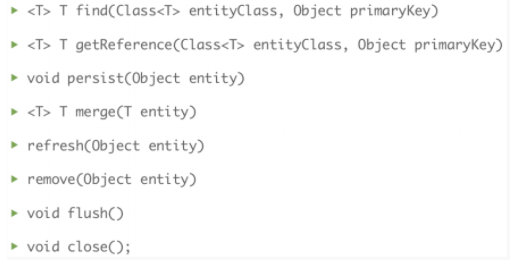

Ещё там есть createQuery, createNativeQuery и тому подобное.
Для выполнения запросов используются SQL, JPQL (Java Persistence Query Language - SQL-подобный язык для работы с объектами вместо сущностей) и Criteria API (не SQL-подобные текстовые запросы, а методы).

#### createQuery/createNativeQuery

```java
EntityManagerFactory emfactory = Persistence.
			createEntityManagerFactory("Eclipselink_JPA");
EntityManager entitymanager = emfactory.
				createEntityManager();
	//Scalar function
Query query = entitymanager.
createQuery("Select UPPER(e.ename) from Employee e");
List<String> list=query.getResultList();		
Query query = entitymanager.		
createQuery("Select e.ename from Employee e");		
List<Employee> eList=query.getResultList();						
```
Метод createQuery используется для создания динамических запросов, которые являются запросами, определенными непосредственно в бизнес-логике приложения.
 ```java
public List findWithName(String name) {
return em.createQuery(
"SELECT c FROM Customer c WHERE c.name LIKE :custName")
.setParameter("custName", name)
.setMaxResults(10)
.getResultList();
}
```
Метод createNamedQuery используется для создания статических запросов или запросов, определенных в метаданных с помощью аннотации javax.persistence.NamedQuery. Элемент name @NamedQuery указывает имя запроса, который будет использоваться с методом createNamedQuery. Элемент запроса @NamedQuery является запросом:

Метод createNativeQuery создать экземпляр запроса для выполнения собственного SQL заявление. вот несколько причин для выбора createNativeQuery :

- Доступ низкого уровня, что означает, что вы можете оптимизировать и обрабатывать отображение самостоятельно; с SQL вы фактически получаете доступ к таблице базы данных, а с JPQL-к объектам сущностей;
- Может быть, вы не хотите учиться JPQL, если вы уже знаете SQL
- У вас уже есть запросы, написанные в SQL, и нет ресурсов/времени, чтобы перенести их в JPQL

#### JPQL

JPQL (Java Persistence query language) это язык запросов, практически такой же как SQL, однако
вместо имен и колонок таблиц базы данных, он использует имена классов Entity и их атрибуты. В
качестве параметров запросов также используются типы данных атрибутов Entity, а не полей баз
данных.

Характерные черты: 
- расширение EJB QL; 
- SQL-подобный синтаксис;
- в запросах указываются объекты/свойства вместо таблиц/колонок; 
- поддерживаются подзапросы.

Синтаксис JPQL очень подобен к синтаксису SQL. Иметь SQL как синтаксис преимущество потому что SQL прост и широко используем. SQL работает сразу против таблиц реляционной базы данных, показателей, и полей, тогда как JPQL работает с типами и примерами Java.

JPQL поддерживает именованные параметры, которые начинаются с символа двоеточия ':'

#### Criteria API

Характерные черты: 
- Объектно-ориентированный API для построения запросов. 
- Есть возможность отобразить любой JPQLзапрос в Criteria. 
- Поддерживает построение запросов в runtime.

- Необходимо указать сущности, участвующие в запросе (query roots).
- Условие запроса задается через where(Predicate p), где аргумент устанавливает необходимые
ограничения.
- Метод select() определяет, что мы получим в результате запроса.
```java
Root customer = qdef.from(Customer.class);
qdef.select(customer).where(queryBuilder .equal(customer.get("customerInfo"), ci));
```
The Criteria API is an API for building queries with Java™ objects, as an alternative to building strings for Java Persistence Query Language (JPQL) queries.

The Criteria API supports building queries dynamically at run time, and also the ability to build type-safe queries that can be verified by the compiler. The correctness of JPQL queries cannot be verified by the compiler, and must be verified at run time during testing.

```jpaql
SELECT e FROM Employee e WHERE e.serviceyears < 5
```

```java
QueryBuilder qb = emf.getQueryBuilder();
CriteriaQuery q = qb.create(Employee.class);
Root e = q.from(Employee.class);
q.where(qb.lt(e.get(Employee_.serviceyears), 5));
TypedQuery tq = em.createQuery(q);
List result = q.getResultList();
```

Two important features are improvements from JPQL:  
- The Criteria API can express queries that are not possible through JPQL. 
- A CriteriaQuery can be edited programmatically. 

### 3. Написать компонент ejb для списания средств со счета клиента и начисления их на счет банка за одну транзакцию

Транза́кция — группа последовательных операций с базой данных, которая представляет собой логическую единицу работы с данными

```java
@Stateful
@TransactionManagement(BEAN)
public class MySessionBean implements MySession {
@Resource UserTransaction ut;
    public void method() {
        try {
            ut.begin(); // Открываем транзакцию
            //... какие-то действия
            // вызвать метод у database bean для клиента getMoneyAway. Который спишет деьги и вернет их
            // вызвать метод у database bean для банка acceptMoney. Который зачислит деньги
            ut.commit(); // Закрываем транзакцию
        } catch (Exception e) {
            ut.rollback(); // Ошибка — откат транзакции
        }
    }
}       
```
```java
@Stateless
@TransactionManagement(BEAN)
public class MyBean {
   @Resource
   UserTransaction ut;
   public void pay(Bank bank, Client client, double sum) {
       try {
           ut.begin();
           client.setWalletValue(client.getWalletValue - sum);
           bank.setWV(bank.getWV+sum);
           ut.commit();
       } catch (Exception e) {
           ut.rollback();
       }   }
}
```

## Билет 13

### 1. Фаза обновления значений компонентов, фаза вызова приложения

#### Фаза обновления значений компонентов 
- Если данные валидны, то значение компонента обновляется. Новое значение присваивается полю
объекта компонента.

- На фазе обновления значений компонентов уже отработали валидаторы, значит данные условно валидны и мы передаем эти данные в проперти бина. 

- Обновление свойства managed bean информацией из дерева компонентов.

#### Фаза вызова приложения

- Управление передается слушателям событий. Формируются новые значения компонентов.

- В процессе обновления мы можем исполнить евенты, на которые кто то подписан. если event listener запустил responseComplete(), то обработка запроса прекращается, если запустили renderResponse() обработка уходит на стадию формирования ответа. На фазе вызова приложения оставшиеся события передаются для обработки приложению

- JSF обрабатывает события, которые были сгенерированы нажатием на кнопки и ссылки. На данном этапе также решаются вопросы, связанные с навигацией приложения, если это необходимо. Если один из компонентов формы имеет свойство immediate="true", то он должен был быть обработан в фазе "Применение значений запроса".

### 2. ЖЦ spring- приложения

1. Парсинг конфигураций, создание объектов BeanDefinition  
beandefinition reader парсит конфиг,( разные типы ридеров парсят разные конфиги) 

2. Настройка объектов BeanDefinition  
и создает beandefinition это метаинформация о бинах, их скоуп, название и т. д

3. Создание объектов собственных FactoryBean<T>   
потом создаются beanfactorypostprocessor которые имеют доступ к beandefinition, которые могут изменить дефинишны

4. Создание экземпляров бинов  
beanfactory вызывает конструкторы бинов, скармливает бины пострпроцессорам

5. Настройка экземпляров бинов  
которые могут например распарсить аннотации и по ним создать динамические прокси от бинов и добавить им функционал, после этого фактори складывает бины в ИОС контейнер.

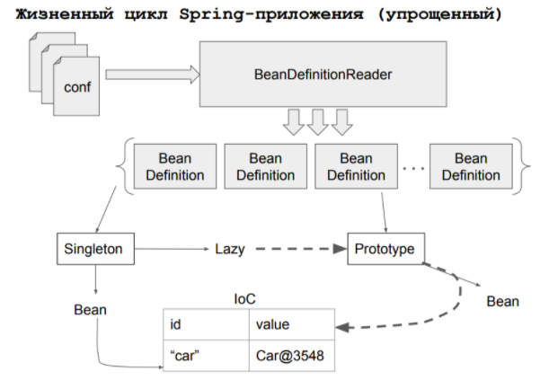

Почтовый процессор Bean Factory (BFPP):

Используется, когда мы хотим переопределить XML / аннотации, потому что Spring читает XML / аннотации для создания bean-компонентов. Если вы хотите предоставить Spring другую конфигурацию во время создания (во время выполнения), вам необходимо использовать BFPP. Создание внутреннего графа зависимостей - это однократный процесс.

Постпроцессор Bean (BPP):

Вышеупомянутый шаг произошел только один раз. Это похоже на создание «меню» из бобов. После создания bean-компонента, если вы хотите изменить свойства bean-компонента, вы не сможете вносить какие-либо изменения в XML / аннотации. Вместо этого вы можете использовать BPP для изменения конфигурации bean-компонента после создания. BPP имеет 2 области выполнения, одну перед @postconstruct и одну после @postconstruct.

postProcessBeforeInitialization
postProcessAfterInitialization


___________________________________

ЖЦ обработки запросов с браузера?:

Более подробный,

- DispatcherServlet использует обработчики, чтобы решить "which controller" обслуживать этот запрос.

- Контроллеры являются / должны быть "легковесными" - должны быть отделены от сервисные процессы в бэк-энде как хорошая практика проектирования-они содержат ссылки на сервис(Ы) и вызывают правильный(ые). Их "mission" заключается в контроле процесса обслуживания (ов) для построения модели и передачи он вернулся к диспетчеру для следующего шага.

- Компонент View сам по себе состоит из 2 частей: сначала ViewResolver выбирает правильный тип вида поиска, чтобы поместить модель в окончательный формат для пользователя.

С точки зрения разработчика, DispatcherServlet - это behind-the-scenes вещь. Все, что я делаю, это определяю и настраиваю его, если это необходимо, в web.xml. Как разработчик, я создаю экземпляр ApplicationContext (есть много типов ApplicationContext - я выбираю один в зависимости от того, что мне нужно, обычно это WebApplicationContext(?)). AplicationContext-это фабрика, которая создает все сервлеты / бобы, включая DispatcherServlet, используя их описания в файлах .xml. DispatcherServlet затем работает за кулисами и управляет весь процесс-- goes&gets контроллеры, используя аннотации или их .xml описания, представления, обработчики, валидаторы и т.д.

____

BeanFactory предоставляет механизм конфигурации по управлению любым типом объектов. ApplicationContext - наследует нитерфейс BeanFactory и добавляет более специфичную функциональность.

Ниже представлена диаграмма, отражающая, как работает Spring. Ваши классы приложения совмещаются с метаданными конфигурации, в результате чего будет создан и инициализирован ApplicationContext, а на выходе вы получите полностью настроенное и готовое к выполнению приложение.

В метаданных конфигурации разработчик описывает как инициализировать, настроить IoC контейнер и собрать объекты в вашем приложении. 

### Настройка IoC контейнера

Основными признаками и частями Java-конфигурации IoC контейнера являются классы с аннотацией @Configuration и методы с аннотацией @Bean. Аннотация @Bean используется для указания того, что метод создает, настраивает и инициализирует новый объект, управляемый Spring IoC контейнером. Такие методы можно использовать как в классах с аннотацией @Configuration, так и в классах с аннотацией @Component(или её наследниках). Класс с аннотацией @Configuration говорит о том, что он является источником определения бинов. Самая простейшая из возможных конфигураций выглядит следующим образом:

```java
package lessons;

import org.springframework.context.annotation.Configuration;

/**
 * Конфигурационный класс Spring IoC контейнера
 */
@Configuration
public class LessonsConfiguration {
}
```

Для того, чтобы приступить к настройке и изучению Spring IoC контейнера, вы должны инициализировать ApplicationContext, который поможет также с разрешением зависимостей. Для обычной Java-конфигурации применяется AnnotationConfigApplicationContext, в качестве аргумента к которому передается класс, либо список классов с аннотацией @Configuration, либо с любой другой аннотацией JSR-330, в том числе и @Component:

```java
public class Starter {

    private static final Logger logger = LogManager.getLogger(Starter.class);

    public static void main(String[] args) {
        logger.info("Starting configuration...");

        ApplicationContext context = new AnnotationConfigApplicationContext(LessonsConfiguration.class);
    }
}
```

### Использование @Bean аннотации

Как упоминалось выше, для того, чтобы объявить Bean-объект(далее просто бин), достаточно указать аннотацию @Bean тому методу, который возвращает тип бина как в классах с аннотацией @Configuration, так и в классах с аннотацией @Component(или её наследниках). Например, определим интерфейс какого-нибудь сервиса и его реализацию:

```java
package lessons.services;

public class GreetingServiceImpl implements GreetingService {

    @Override
    public String sayGreeting() {
        return "Greeting, user!";
    }
}
```

```java
@Configuration
public class LessonsConfiguration {
    @Bean
    GreetingService greetingService() {
        return new GreetingServiceImpl();
    }
}
```

```java
public class Starter {

    private static final Logger logger = LogManager.getLogger(Starter.class);

    public static void main(String[] args) {
        logger.info("Starting configuration...");

        ApplicationContext context = new AnnotationConfigApplicationContext(LessonsConfiguration.class);
        GreetingService greetingService = context.getBean(GreetingService.class);
        logger.info(greetingService.sayGreeting());  // "Greeting, user!"
    }
}
```

Однако такой подход не рекомендуется использовать в production-конфигурациях, т.к. для подобных целей существует механизм Dependency Injection (DI), собственно говоря, для чего и предназначен Spring IoC контейнер. Использование DI будет рассмотрено ниже в отдельной главе.

Как было описано выше, Spring IoC контейнеру требуются метаданные для конфигурации. Одну из таких аннотаций мы уже рассмотрели, это @Bean, рассмотрим теперь и другие.

Другой основной аннотацией является @Component, а также её наследники @Repository, @Service и @Controller. Все они являются общими шаблонами для любых компонентов, управляемыми контейнеером. @Repository, @Service и @Controller рекомендуется использовать в тех случаях, когда вы можете отнести аннотируемый класс к определенному слою, например DAO, либо когда вам необходима поддержка функциональности, которую предоставляет аннотация. Также эти аннотации могут иметь дополнительный смысл в будущих версиях Spring Framework. В остальных же случаях достаточно использовать аннотацию @Component.

### Области видимости(scopes) бинов

- singleton - По умолчанию. Spring IoC контейнер создает единственный экземпляр бина. Как правило, используется для бинов без сохранения состояния(stateless)
- prototype - Spring IoC контейнер создает любое количество экземпляров бина. Новый экземпляр бина создается каждый раз, когда бин необходим в качестве зависимости, либо через вызов getBean(). Как правило, используется для бинов с сохранением состояния(stateful)
- request - Жизненный цикл экземпляра ограничен единственным HTTP запросом; для каждого нового HTTP запроса создается новый экземпляр бина. Действует, только если вы используете web-aware ApplicationContext
- session - Жизненный цикл экземпляра ограничен в пределах одной и той же HTTP Session. Действует, только если вы используете web-aware ApplicationContext
- global session - Жизненный цикл экземпляра ограничен в пределах глобальной HTTP Session(обычно при использовании portlet контекста). Действует, только если вы используете web-aware ApplicationContext
- application - Жизненный цикл экземпляра ограничен в пределах ServletContext. Действует, только если вы используете web-aware ApplicationContext

```java
@Component
@Scope("prototype")
public class GreetingServiceImpl implements GreetingService {
    //...
}
```


~~### 3. Бэкэнд для магазина на GWT RCP(!). Типа поля с названием, ценой, кол-вом и т.д.~~

## Билет 18

### 1. JNDI
Для того, чтобы понять, как фактически реализуются принципы IoC и CDI на уровне платформы Java EE и Spring, нужно познакомиться с JNDI
 
JNDI — это набор Java API, организованный в виде службы
каталогов, который позволяет Java-клиентам открывать и
просматривать данные и объекты по их именам (С) Wikipedia.

Служба каталогов - сферическая вакуумная иерархическая БД

Классический вариант использования службы каталогов - LDAP сервер (когда информация о юзерах (логин и пароль), )
Авторизаця на гелиосе происходит через LDAP - это протокол. Он имплементится сервером каталогов. 

Де-факто все наши аккаунты хранятся в опред иерархической базе данных. Есть каталог со студенческими аккаунтами, есть с преподавательскими. 

Все современные серверные ОС поддерживают авторизацию через сервер каталогов, аналогичным образом это поддерживают СУБД, Java и все они на него настроены. => все они используют сквозную базу пользовательских аккаунтов

JNDI - другой аспект использования этих служб каталогов. Мы в ирерархическую структруру объединяем не пользователей, а какие-то ресурсы java. (бины, например, чтобы их потом кто-то мог использовать)

Унифицированное API к реляционной базе данных = JDBC (через драйвер)
Унифицированное API к службе каталогов  = JNDI (драйвер, который по сути адаптер)

Мы ищем в службе каталога какой-то ресурс:
1) Мы делаем из java кода запрос к JNDI API (найди мне какой-то ресурс плиз)
2) Эта штука транслрует его через адаптер-драйвер в синтаксис запроса конкретной иерархической БД, которая используется для хранения нашей иерархии каталогов
3) Получает результат и обратно конвертит на уровень java придложения

Как любое другое Java API, как набор интерфейсов, JNDI не зависит от нижележащей реализации. В
дополнению к этому, он предоставляет реализацию service provider interface (SPI), которая позволяет
службам каталогов работать в паре с каким-либо фреймворком. Это может быть сервер, файл или база

Есть такая штука - JNDI - набор API, позволяющий доставать объекты из контейнера по их именам.
 По сути, это замена обращению по ссылкам, и благодаря этому легко 
 реализуется Dependency Lookup и Dependency Injection. 
 Хранение объектов в таком случае можно представить как Map, 
 где ключи - это имена, а значения - нужные объекты 
 (например, ссылки на них).

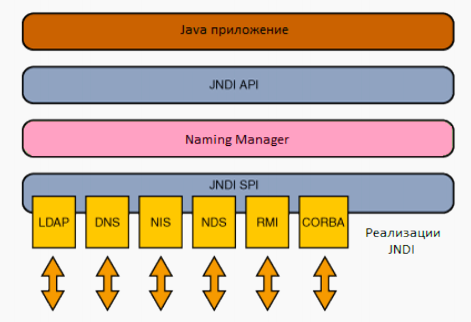

#### JNDI API

Два варианта использования JNDI:
- CDI (аннотации) — работает только в managed компонентах. (де-факто это тоже обращение к JNDI, это такой синтаксический сахар, который позволяет обернуть логику обращения к JNDI, заменить его на некое задание метаинформации. По этой метаинформации сам Application server в итоге обратится к JNDI)
- Прямой вызов API — работает везде. (когда JNDI не локальный, а удаленный)

```java
// Пример получения ссылки на JDBC datasource.
DataSource dataSource = null; // dataSource - ресурс, который лежит в JNDI 
try {
// Инициализируем контекст по умолчанию.
Context context = new InitialContext(); // формирует initial контекст на jndi runtime (на какого-то провайдера, который находится на дефолтной машине на дефолтном порту)
// по сути здесь происходит формирование подключения к БД, которая по дефолту находится на localhost и опред порту
// ручками можно это переопределить и подключиться к удаленному JNDI на другой хост и порт
dataSource =
(DataSource) context.lookup("Database"); // context - оберточка над иерархической БД
} catch (NamingException e) {
 // Ссылка не найдена
}
```

____

JNDI - набор API, позволяющий доставать объекты из контейнера по их именам. По сути, это замена обращению по ссылкам, и благодаря этому легко реализуется Dependency Lookup и Dependency Injection. Хранение объектов в таком случае можно представить как Map, где ключи - это имена, а значения - нужные объекты (например, ссылки на них).
Пример: 
```java
WtfBean example = new InitialContext().lookUp(“wtf_bean’s name”);
```  
Контекст - это, как ни странно, контекст приложения - необходимая часть контейнера, в котором используются IoC и CDI.

### 2. React js

React - это JS библиотека(!!!). Обратите внимание, что именно
библиотека, а не фреймворк (отличаются инверсией управления), которая
предназначена для создания пользовательских интерфейсов. 

У него открытый исходный код. Если говорить о популярности, то у
реакта 160 тысяч звездочек. К примеру, у Ангуляра 68 тысяч.

На слайде есть картиночка вольного сравнения популярности Vue, Angular и
React с помощью гугл трендов. Реакт достаточно популярен сейчас, но это не в
коем случае не значит, что нужно использовать только реакт. Например, Angular
имеет более mvc - шную архитектуру, а у Vue гораздо субъективно меньше порог
вхождения.

Также React предназначен в основном для создания одностраничных
приложений или Single Page Application.

#### Особенности

- Библиотека для построения ui.
- Использует компонентный подход для создания ui.
- Использует jsx для построения дом модели. 
- Использует виртуальный дом для оптимизации рендера компонентов. (не обновляет дом целиком, а обновляет виртуальный дом и сравнивает, что нужно обновить в текущем состоянии дома). 
- Есть умные и глупые компоненты.
- У умных компонентов можно управлять состоянием и методами жизненного цикла компонента
- Однонаправленный поток данных - передача данных от родителей к потомкам через props

____

Умный:
```javascript
class comp extends React{
	constructor(props){// конструктор, можно задавать изначальное состояние, обязательно вызывать супер
			super(props)
			this.state = {
		    id: 0,
		    name: PipSucks
            }
    }
//переопределение методов реакта типа componentDidMount, componentShouldUpdate или свои методы для обработки событий (еще примеров есть в заданиях) 

    render(){
        return(...//Элемент, хтмл код со всякими вставками if и тд
                <CustomElem parentName={this.state.name}>Hello</CustomElem >
                //передача в пропсы потомка чего-нибудь из состояния компонента
        )           
    }
}

```

Глупый: 

```javascript
function Hello(props){
	return <h2>Hello, {props.name}</h2>
}

const element = <Hello name=”qwerty”/>
```
### 3. Написать бин который выводит количество минут, прошедших со старта сервера

```java
@ManagedBean
@ApplicationScoped
public class CounterBean implements Serializable{
    private Date init;

    @PostConsruct
    public void postConstruct() { 
        init = new Date();
    }
    public long getMinutesAfterRestart() { 
        Date currentDate = new Date();
        return (currentDate.getTime()-init.getTime()) / 1000 ; 
    }
    public void setMinutesAfterRestart() {}
}


```

## Билет 23 
### 1. Обращение к session bean из managed и unmanaged кода

Managed-код находится внутри managed компонентов, то есть компонентов, которыми управляет / о которых знает контейнер, то есть над которыми применимы IoС и CDI. Соответственно, обращение к SessionBean из managed-кода осуществляется с помощью CDI (аннотация @EJB над полем, в котором должен лежать этот бин),   
а из unmanaged - с помощью JNDI. Примеры:

```java
@EJB(name="beanName", beanInterface = Bean.class)

//Unmanaged
Bean beanInstance = (Bean) new InitialContext().lookup("java:comp/env/beanName");
```

___

- Managed - жизненным циклом управляет RunTime. Можно обратиться через аннотации. Пример:
@EJB
- Unmanaged - не управляет RunTime. Можем обратиться через JNDI, то есть к реестру по
определённому имени в реестре:
Context context = InitialContext();
Database database = context.lookup(‘PostgreSQL’)

### 2. Структура в react. Jsx.(может как-то иначе сформулировано)

Структура реакт приложений - древовидная, основанная на прямом потоке данных, где родители могут что то передать детям. по этой структуре строится виртуальный дом, а затем реальный. Jsx  - язык, который выглядит, как смесь js и html, мы можем помечать код как js вставку с помощью {}. Все потом парсится в js с помощью бабеля
___

React представляет собой дерево из компонентов. Точкой входа (корнем) являет index.js который
определяет дальше компоненты. Каждый компонент включает в себя другие компоненты или
являются листьями дерева.

### 3. JSF Manager Bean, после инициализации HTTP-сессии формирующий коллекцию с содержимым таблицы Н_УЧЕБНЫЕ_ПЛАНЫ. Для достпула к БД необходимо использовать JDBC-ресурс jdbc/OrbisPool.

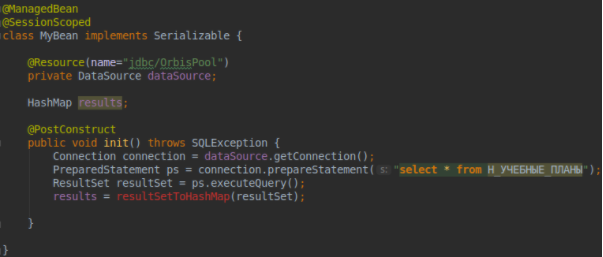

## Билет 32
### 1. Проблемы ORM 

- Проблема идентичности. 

    Несколько неидентичных объектов представляют одну строку базы данных

    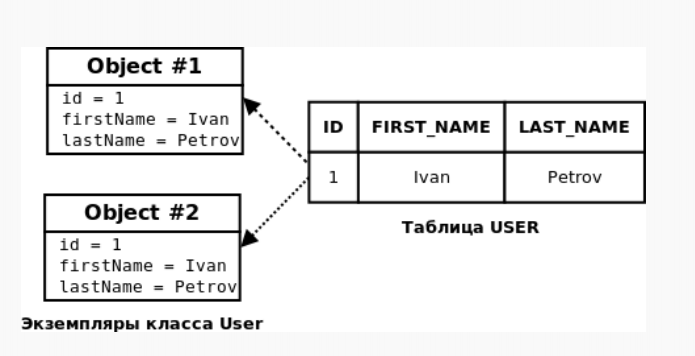

    Возможны три варианта:  
    1)Обычный уровень хранения без управления
    идентичностью (no identity scope).  (забиваем, кто сохранил, тот и победил. Никакого противоречия нет) (ничего не сонхранизируется никогда)
    2)Уровень хранения с контекстно-управляемой
    (context-scoped) идентичностью .  (гибкий подход) (используется в EJB?)
    3)Уровень хранения с жестким управлением
    идентичностью (process-scoped identity). (все синхронизируется всегда)

- Представление наследования и полиморфизма. 

    [тык](#orm)
    
- Проблема навигации между данными.

Существует фундаментальное различие между способами доступа к данным
в Java и реляционной базе данных. Чтобы получить доступ к платежной информации пользователя в Java, вы вызываете someUser.getBillingDetails().iterator().
next() или что-то подобное. Это наиболее естественный способ доступа к объектно-ориентированным данным, который обычно называется обходом графа объектов. Вы перемещаетесь от одного экземпляра к другому и даже перебираете коллекции, следуя за подготовленными указателями между классами. К сожалению,
это не самый лучший способ получения информации из базы данных SQL.

_____
 
Проблемы в ORM:  
1. Ошибки в реализации трудно найти, отладить и исправить
2. Ограничения в реализации
3. Могут потребоваться дополнительные таблицы для отображения классов в таблицы
4. Медлительность
~~### 2. Vaadin и gwt, сходства и различия~~
### 3. Написать конфиг JSF страницы которая принимает xhtml запросы и все, чей url начинается на /faces/

```xml
<servlet>
<servlet-name>Faces Servlet</servlet-name>
<servlet-class>javax.faces.webapp.FacesServlet</servlet-class>
<load-on-startup>1</load-on-startup>
</servlet>
    <servlet-mapping>
        <servlet-name>Faces Servlet</servlet-name>
        <url-pattern>*.xhtml</url-pattern>
    </servlet-mapping>
    <servlet-mapping>
        <servlet-name>Faces Servlet</servlet-name>
        <url-pattern>/faces/*</url-pattern>
    </servlet-mapping>
```

## Билет ? (1)
### 1. JTA

Java Transaction Api - дает возможность управления транзакцией не на уровне орм, а на уровне жава кода. инжектится юзертранзактион от него можно делать бегин, коммит, ролбэк 
Нужно для того, чтобы, когда наше приложение работает сразу с нескольких JVM (и юзаются RemoteBean’ы), транзакции распространялись на все JVM, то есть сохраняли изолированность.

Интерфейс для управления транзакциями в EJB-компонентах.
Позволяет открывать, закрывать и откатывать транзакции.

```java
public interface TransactionInterface {
public openTransaction(UserTransaction trns){}
public closeTransaction(UserTransaction trns){}
public rollbackTransaction(UserTransaction trns){}
}
```

```java
@TransactionManagment(BEAN)
public class Transactions implements TransactionInterface{
    @Resource UserTransaction trns;

    public openTransaction(UserTransaction trns){
        trns.open();
    }

    public closeTransaction(UserTransaction trns){
        trns.close();
    }

    public rollbackTransaction(UserTransaction trns){
        trns.rollback();
    }
}
```

Основываясь на спецификации EJB, вы не можете передать контекст транзакции из боба (в этом случае ваш основной класс ... ) используя программную транзакцию в другой боб (в данном случае, другой) используя программную транзакцию

Для EJB3 вы обычно определяете распространение транзакций с помощью аннотации @TransactionAttribute.

### Отличие @TransactionAttribute от UserTransaction

#### Container Managed Transactions

EJB 3.0 has specified following attributes of transactions, which EJB containers implement −

REQUIRED − Indicates that business method has to be executed within transaction, otherwise a new transaction will be started for that method.

REQUIRES_NEW − Indicates that a new transaction, is to be started for the business method.

SUPPORTS − Indicates that business method will execute as part of transaction.

NOT_SUPPORTED − Indicates that business method should not be executed as part of transaction.

MANDATORY − Indicates that business method will execute as part of transaction, otherwise exception will be thrown.

NEVER − Indicates if business method executes as part of transaction, then an exception will be thrown.

```java
package com.tutorialspoint.txn.required;
 
import javax.ejb.*;
 
@Stateless
@TransactionManagement(TransactionManagementType.CONTAINER)
public class UserDetailBean implements UserDetailRemote {
	
   private UserDetail;

   @TransactionAttribute(TransactionAttributeType.REQUIRED)
   public void createUserDetail() {
      //create user details object
   }
}
```
#### Bean Managed Transactions

```java
package com.tutorialspoint.txn.bmt;
 
import javax.annotation.Resource;
import javax.ejb.Stateless;
import javax.ejb.TransactionManagement;
import javax.ejb.TransactionManagementType;
import javax.transaction.UserTransaction;
 
@Stateless
@TransactionManagement(value=TransactionManagementType.BEAN)
public class AccountBean implements AccountBeanLocal {
 
   @Resource
   private UserTransaction userTransaction;

   public void transferFund(Account fromAccount, double fund , 
      Account toAccount) throws Exception{

      try{
         userTransaction.begin();

         confirmAccountDetail(fromAccount);
         withdrawAmount(fromAccount,fund);

         confirmAccountDetail(toAccount);
         depositAmount(toAccount,fund);

         userTransaction.commit();
      }catch (InvalidAccountException exception) {
         userTransaction.rollback();
      }catch (InsufficientFundException exception) {
         userTransaction.rollback();
      }catch (PaymentException exception) {
         userTransaction.rollback();
      }
   }

   private void confirmAccountDetail(Account account) 
      throws InvalidAccountException {
   }

   private void withdrawAmount() throws InsufficientFundException {
   }

   private void depositAmount() throws PaymentException{
   }
}
```

### 2. React Router

Router определяет набор маршрутов и, когда к приложению приходит запрос, то Router выполняет
сопоставление запроса с маршрутами. И если какой-то маршрут совпадает с URL запроса, то этот
маршрут выбирается для обработки запроса.  

Каждый Router создает объект history который хранит путь к текущему location[1] и перерисовывает интерфейс сайта когда происходят какие то изменения пути.
Остальные функции предоставляемые в React Router полагаются на доступность объекта history через context, поэтому они должны рендериться внутри компонента Router.

Для выбора маршрута определен объект Switch. Он позволяет выбрать первый попавшийся
маршрут и его использовать для обработки. Без этого объекта Router может использовать для
обработки одного запроса теоретически несколько маршрутов, если они соответствуют строке
запроса.  
Каждый маршрут представляет объект Route. Он имеет ряд атрибутов. В частности, для маршрута


устанавливаются два атрибута:  
- path: шаблон адреса, с которым будет сопоставляться запрошенный адрес URL (Рендериться будут все вариации urlов, содержащие path, если не указать exact. Тогда будет рендериться строго переданный url.
)
- component - тот компонент, который отвечает за обработку запроса по этому маршруту 
 
Switch - для поиска первого совпавшего пути (прим. сначала идет “/’, потом “/main”, мы ищем “/main”,
откроет “/”
BrowserHistory - сохраняется в историю, имеет человеческие назавния (если приложение нестатическое (обрабатываются динамические запросы))
HashHistory - не сохраняется, имеет хэши в URL

<BrowserRouter> -это <Router> , который использует HTML5 history API (pushState, replaceState и событие popstate), чтобы сохранить ваш UI в sync с URL.

#### BrowserRouter и HashRouter
Первое отличие:  
- Они используют разные WEB APIs. <HashRouter> использует и считывает hash из URL, <BrowserRouter> использует window.history WEB API.
  
Второе различие:  
- <HashRouter> используется для статического одностраничного сайта. Идеально подходит для браузерных проектов. <BrowserRouter> используется для динамического веб-сайта. Следует использовать, когда у вас есть сервер, который будет обрабатывать динамические запросы (знает, как реагировать на любые возможные URL).

Оба из них создадут специальный объект истории. Вы должны использовать BrowserRouter, если у вас есть сервер, который отвечает на запросы, и HashRouter, если вы используете статический файловый сервер

```javascript
<Router>
    <Switch>
        <Route exact path="/" component={Main} />
        <Route path="/about" component={About} />
        <Route component={NotFound} />
    </Switch>
</Router>
```
```javascript
<BrowserRouter>
    <Switch>
        <Route exact path="/~s285611/lab4/public/" component={Start}/>
        <Route path="/~s285611/lab4/public/main" component={Main}/>
    </Switch>
</BrowserRouter>
```

### 3. Написать EJB , который " просыпается " в полночь и выводит содержимое таблицы н_люди

из доков по аннотации @Schedule: All elements of this annotation are optional. If none are specified a persistent timer will be created with callbacks occuring every day at midnight in the default time zone associated with the container in which the application is executing.
То есть достаточно просто поставить эту анноташку над нужным методом и магия свершится

```java
@ApplicationScoped
@Singleton // используется инъекция, все дела
public class Bessonnitsa {
	@PersistenceContext(unitName = "movie-unit")
    private EntityManager em;

	@Schedule
	public void doParty() {
            em.createQuery(“SELECT h from н_люди h”)
                        .getResultList()
                        .forEach(p->System.out.println(p.name));
	}
}
```

## Билет ? (2)
### 1. ORM

ORM - Технология, которая позволяет связывать объектное и реляционное отображения. Существуют несколько орм-провайдеров. Самые известные - гибернейт и эклипслинк. Использует jdbc и является высшим уровнем абстракции над jdbc.

Но время шло и разработчики каждый раз сталкивались с необходимостью писать однотипный и ненужный "обслуживающий" код (так называемый Boilerplate code) для тривиальных операций по сохранению Java объектов в БД и наоборот, созданию Java объектов по данным из БД. И тогда для решения этих проблем на свет появилось такое понятие, как ORM.

ORM — Object-Relational Mapping или в переводе на русский объектно-реляционное отображение. Это технология программирования, которая связывает базы данных с концепциями объектно-ориентированных языков программирования. Если упростить, то ORM это связь Java объектов и записей в БД:

EclipseLink is more standards compliant, since it is the reference implementation for JPA 2, Hibernate has some compliancy issues, but is more mature.

One of the main benefits of EclipseLink is that you can call native SQL functions directly in your JPQL queries. In Hibernate this is not directly possible.

But Hibernate has a bigger community, better documentation and also better error messages.

EclipseLink больше соответствует стандартам, поскольку это эталонная реализация для JPA 2, Hibernate имеет некоторые проблемы с совместимостью, но он более зрелый.

Одним из основных преимуществ EclipseLink является то, что вы можете вызывать собственные функции SQL непосредственно в своих запросах JPQL. В Hibernate это невозможно напрямую.

Но Hibernate имеет большее сообщество, лучшую документацию, а также лучшие сообщения об ошибках.

Hibernate:

ORM-фреймворк от Red Hat, разрабатывается с 2001 г.

Ключевые особенности:

Таблицы БД описываются в XML-файле, либо с помощью аннотаций.  
2 способа написания запросов — HQL и Criteria API.  
Есть возможность написания native SQL запросов.  
Есть возможность интеграции с Apache Lucene для полнотекстового поиска по БД (Hibernate Search).  
Расширенная поддержка естественных идентификаторов  
Загрузка нескольких сущностей по их первичному ключу  
Управление созданием и обновлением меток времени  
Присоединение к неассоциированным объектам в запросах  
Поддержка мультитенантности  

EclipseLink

ORM-фреймворк от Eclipse Foundation.

Ключевые особенности:

Основан на кодовой базе Oracle TopLink.  
Является эталонной реализацией (reference implementation) для JPA.  
EclipseLink предлагает другие опции, которых нет в Hibernate.  
Обработка событий изменения базы данных  
Составные блоки сохранения состояния для сопоставления сущностей с таблицами в нескольких базах данных  
Поддержка мультитенантности  

Например:

- @ ReadOnly - указывает, что объект, который будет сохранен, доступен только для чтения

- @ Struct - определяет класс для сопоставления с базой данных «struct» type


Hibernate одна из самых популярных открытых реализаций последней версии спецификации (JPA 2.1). Даже скорее самая популярная, почти стандарт де-факто. То есть JPA только описывает правила и API, а Hibernate реализует эти описания, впрочем у Hibernate (как и у многих других реализаций JPA) есть дополнительные возможности, не описанные в JPA (и не переносимые на другие реализации JPA
 
~~### 2. Don’t помню(~~
### 3. Servlet + html. Посчитать и вывести количество сессий в текущий момент

```jsp
<%! private int count = 0;
private Set<String> sessions; %>
<%
sessions.add(request.getSession().getId());
%>
<%= sessions.size()%>
```

## Билет ? (3)
### 1. RMI. RMI в javaEE

Remote method invocation - технология, которая позволяет вызывать методы удаленных объектов. Объекты передаются по значению, а не по ссылке. Если объект экспортирован передается заглушка(stub). Передаваемые объекты должны быть сериализуемыми

RMI тесно связан с принципом Location Transparency. Пример использования RMI (и, соответственно, реализации Location Transparency): Remote EJB и Local EJB. Для клиента создаётся видимость целостности приложения, как будто оно не распределено по разным серверам с разными JVM, то есть для использования Remote EJB ему не надо делать дополнительных движений.

### 2. Инициализация Spring Beans

Итак, поехали
У Spring есть четкий порядок инициализации объектов:  
Формируется Configuration Metadata, она может быть создана из XML-контекста, из конфигурации с помощью Annotations либо Java Configuration.  
Все объекты, которые имплементируют интерфейс BeanFactoryPostProcessor, читают Metadata и изменяют ее в соответствии со своим предназначением.  
Вся Metadata, которую модифицировали и нет, передается в BeanFactory, которая непосредственно и создает spring beans.  
Все объекты, которые имплементируют интерфейс BeanPostProcessor, производят pre initializing- и post initialization-действия.  
Все бины, которые уже были инициализированы, отдаются в IoC Container.  

### 3. Компонент для React, реализующий интерфейс ввода данных для банковской карты: номер (16 цифр); имя (латинские символы); срок действия(mm/yy); зазитный код (3 цифры)

```javascript
import {React} from 'react'

export class CreditCard extends React.Component{
    constructor(props){
        super(props)
        this.state = {
            number = '',
            data = '',
            owner = '',
            CVV = ''
        }
    //Так же все методы надо привязать,чтобы использовать this в них, приведу один
    this.onChange = this.onChange.bind(this)
    }

    //Все аналогичны, напишу один
    onChange(e) {
    //Вот тут делаете валидацию или добавляете / если это Data
    this.state.number = e.value
    }
    onClick(e) {
    sendData(this.state.number, this.state.date, this.state.CVV, this.state.owner)
    }

    render() {
        return(
            <input onChange={this.onChangeNumber(event)} value={this.state.number}/>
            <input onChange={this.onChangeData(event)} value={this.state.data}/>
            <input onChange={this.onChangeOwner(event)} value={this.state.owner}/>
            <input onChange={this.onChangeCVV(event)} value={this.state.CVV}/>
            <button onClick={this.onClick() }/>
        )
    }

    export default CreditCard;

}
```

```javascript
handleChange = name => event => {
       this.setState({
           [name]: event.target.value,
       });
   };
```
```javascript
render() {
        return (
            <div>
                <form id="formLogIn" >
                    <h1>Введите данные карты:</h1>
                    <h3>Номер:</h3>
                    <InputText maxlength="16" keyfilter={/[0-9^\s]/} value={this.props.number} onChange={this.handleChange('number')}/>
                    <h3>Имя:</h3>
                    <InputText keyfilter={/[A-z^\s]/} value={this.props.name} onChange={this.handleChange('name')}/>
                    <h3>Срок действия:</h3>
                    <Calendar value={this.state.date} onChange={this.handleChange('date')} view="month" dateFormat="mm/yy" yearNavigator={true} yearRange="2010:2030"/>
                    <h3>Защитный код:</h3>
                    <InputText maxlength="3" keyfilter={/[0-9^\s]/} value={this.props.code} onChange={this.handleChange('code')}/>
                    <Button label="Send" onClick={this.clickButton}/>
                </form>
            </div>
        );
    }
 }

```
## Билет ? (4)
### 1. JMS и реализация в Java

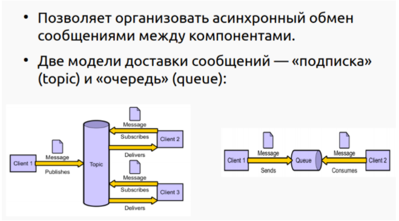
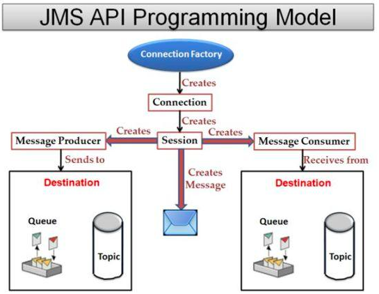

На самом деле можно и синхронно (то есть получатель вызывает метод receive, и ему либо даётся Message, либо null). 

Есть три важные штуки: Session, MessageProducer и MessageConsumer. Вся схема с доставкой / получением сообщений будет работать только пока сессия запущена. Она может быть приостановлена методом stop и возобновлена start. Методами сессии создаются поставщики и потребители. Для каждого из них можно передать в конструктор куда они будут обращаться (topic или queue), но если этого не сделать, то при отправке / получении сообщения можно будет указать куда / откуда это делать.   
С поставщиком всё просто: формирует сообщение (разные для разных типов контента) и вызывает producer.send(msg). С потребителем интереснее: он может сделать receive (синхронный способ, может выдавать null), а можно навесить на этого потребителя MessageListener, который будет вызываться как только сообщение будет доставлено, а не когда потребитель этого захочет, то есть асинхронно.  
Теперь про разницу между Topic и Queue. В случае топика поставщик - это что-то типа блоггера, он пишет сообщение, а подписота читает. Однако у сообщений есть тайм-аут, после которого их уже нельзя будет получить. В случае Queue сообщение исчезнет как только какой-либо потребитель его получит, то есть гарантируется, что только один юзер получит его. Таймаута на сообщении нет. Юзер может отказываться от сообщения, чтобы следующий в очереди мог посмотреть, не ему ли оно  

### 2. State в React redux и flux

Общее состояние для всего приложения. Хранится в Redux store, не должно меняться никак кроме использования метода dispatch, который принимает reducer.   
Reducer - функция, которая принимает старое состояние и действие(объект с данными, которые меняем - опционально и типом действия - type - обязательно) и возвращает новое состояние в зависимости от типа действия.  
Умные компоненты могут получать доступ к значениям стейтам и редюсерам с помощью метода connect, который используя прописанные в компоненте функции mapStateToProps, mapDispatchToProps.  
Редюсеры также позволяют работать не со всем стейтом, а с его частями, объединяя их в одно с помощью метода combineReducers. Просто получить значение стейта - getState(). Узнать об изменениях в стейте - subscribe(listener) - вызывается всякий раз, когда был вызван dispatch, принимает функцию, которая будет вызвана, возвращает функцию, которая отпишет слушателя.

#### Flux и Redux

Ранее я упоминала, что Flux — это обобщенный шаблон, а не конкретная библиотека. Таким образом, существует ряд различных модулей и фреймворков, которые могут быть использованы для реализации Flux. Но один фреймворк, в частности, зарекомендовал себя как самый популярный. Эта структура — Redux.

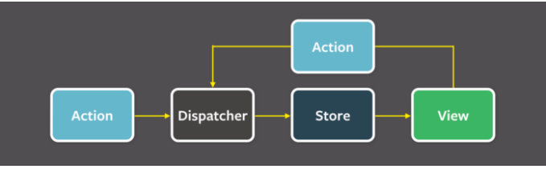

Redux стремится упростить многие концепции, представленные Flux. Является ли Redux, строго говоря, реализацией Flux — вопрос некоторых дискуссий. Redux и Flux схожи в том, что они оба подчеркивают важность однонаправленного потока данных, и они оба корректируют состояние (state) посредством actions с полями type. Тем не менее, они имеют некоторые отличия, которые важно отметить:

Redux:

- Без диспатчера  
  Redux избавляется от концепции диспатчера (dispatcher). Он может сделать это, потому что Redux имеет только одно хранилище (подробнее об этом чуть позже), поэтому существует только один пункт назначения для передачи новых действий (actions), что устраняет необходимость в диспатчере (dispatcher).
  
- Единственный, менее запутанный store
  С Redux все состояние вашего приложения находится в централизованном хранилище (store), которое служит единственным источником правды приложения. Кроме того, были уменьшены обязанности store — теперь он отвечает только за удерживание состояния, и больше не отвечает за определение того, как настроить его state в ответ на actions. Логика для этого теперь была делегирована …

- Reducers
  Редьюсеры — это чистые функции, которые принимают текущее состояние (state) и заданное действие (action) в качестве аргументов, и выводят либо не измененное состояние, либо новую копию состояния. Здесь важен термин «копия» — Redux считает состояние неизменным. Если необходимо изменить состояние, оно не изменяется напрямую. Вместо этого создается копия состояния, и редьюсер редактирует эту копию, затем возвращает ее, и заменяет исходное состояние его измененной копией.  

При создании хранилища Redux, ему дается аргумент одного корневого редьюсера, который отвечает за всю логику этого хранилища. Однако редьюсер может иметь любое количество под-редьюсеров, которые управляют разными подсекциями состояния. Этот процесс известен как композиция редьюсера. Это увлекательный предмет, который, я не буду здесь вдаваться в подробности, является неотъемлемой частью масштабируемости приложения.

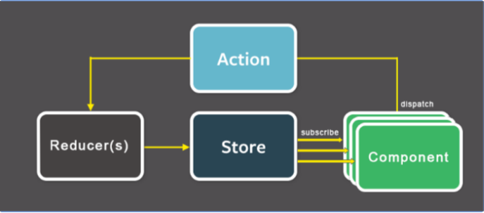

### 3. JPQL запрос из таблицы, который выводит всех сотрудников старше 18 лет по полу age (Date)

JPQL (Java Persistence query language) это язык запросов, практически такой же как SQL, однако
вместо имен и колонок таблиц базы данных, он использует имена классов Entity и их атрибуты. В
качестве параметров запросов так же используются типы данных атрибутов Entity, а не полей баз
данных. 

```jpaql
SELECT p FROM Person p WHERE ((YEAR(CURRENT_DATE)- YEAR(p.birthDate))>18)
```

```java
@Resource EntityManager em

List<Employee> list = em.createQuery(“Select e from Employee e where e.age > 18”).getResultList();
```

## Билет ? (6)
### 1. 3 фаза жизни jsf

Выполнение проверок (Process Validations):
запускаются валидаторы для компонентов, которые проверяют совпадают ли данные с заранее заданными условиями. (мы не проверяем совпадают ли данные по типу это на 2 фазе, когда работают конвертеры) Если на этой фазе ловится ошибка, то остальные скипается и мы рендерим ответ с этой ошибкой

Фазы жизненного цикла:
- Восстановление представления (Restore View) : для запрошенной страницы либо извлекается дерево компонентов, если страница уже открывалась, либо создается новое дерево компонентов, если страница запрашивается впервые. Для компонентов запрашиваемой страницы восстанавливаются их прошлые состояния (форма заполняет вводимыми значениями).
- Применение значений запроса (Apply Request Values) : анализ HTTP запроса, объектам дерева компонентов присваиваются соответствующие им значения из запроса. Если к компоненту подключен конвертер, то значение обрабатывается/конвертируется. При возникновении ошибки, все последующие шаги пропускаются. Если компонент ввода (UIInput) содержит валидатор и имеет свойство immediate="true", то этот компонент будет валидироваться в этой фазе. Также, при необходимости, события (нажатие кнопки или ссылки) добавляются в очередь событий.
- Выполнение проверок (Process Validations) : преобразование строковых значений в "локальные значения" и применение валидации дерева компонентов. Если в результате валидации компонента возникает ошибка, то она сохраняется и JSF пропускает все последующие шаги обработки запроса до фазы "Формирования ответа" для предупреждения пользователя об ошибке.
- Обновление значений модели (Update Model Values) : обновление свойства managed bean информацией из дерева компонентов.
- Выполнение приложения (Invoke Application) : JSF обрабатывает события, которые были сгенерированы нажатием на кнопки и ссылки. На данном этапе также решаются вопросы, связанные с навигацией приложения, если это необходимо. Если один из компонентов формы имеет свойство immediate="true", то он должен был быть обработан в фазе "Применение значений запроса".
- Формирование ответа (Render Response) : JSF создает ответ, основываясь на данных, полученных на предыдущих шагах. Информация страницы обновляется данными из managed bean и генерируется html страница с помощью Renderers. Если на предыдущих шагах происходили какие-либо ошибки, то они инкапсулируются в тег <messages>.
- Страница Java Server Faces представлена в виде дерева компонентов. Корневым компонентом дерева является UIViewRoot.

### 2. IoC DI в Spring 

Бины имеют свои скопы( прототип, синглтон (+ сессия и запрос, если юзается в веб-приложении)) можно реализовать свои области видимости, бины помечаются аннотациями(@service, @component…) организация di идет с помощью @Autowired, @Inject, @Resource. 
можно инжектить с помощью конструктора, можно инжектнуть только какое то поле  
IoC - это когда контейнер занимается порождением и управлением компонентов, и нам не приходится так часто видеть new в коде. Об управлении жизненным циклом компонентов в спринге написано тут.

### 3. сервер JMS, который осуществляет рассылку спама всем подписчикам топика "lol"

```java
@ApplicationScoped
public class Sender {
    @Resource(mappedName = "jms/blablabla")
    private Topic topic;

    @Inject
    private JMSContext context;

    public void sendMessage(String txt) {
    context.createProducer().send(topic, txt);
    }
}
```
____

```java
@Resource(mappedName="jms/ConnectionFactory")
private static ConnectionFactory connectionFactory;
@Resource(mappedName="lol")
private static Topic topic;

public void sendSpam() {
	Connection connection = connectionFactory.createConnection();
        try {
            Session session = connection.createSession(false,
     			Session.AUTO_ACKNOWLEDGE);
	        MessageProducer producer = session.createProducer(topic);
	        connection.start();
            TextMessage message = session.createTextMessage();
            message.setText(“даже школьник смог написать сайт просто прочитав этот ...”);
            while (true) {
                producer.send(message);
                Thread.sleep(1000 * 60);
            }
        catch (InterruptedException e) {
        e.printStackTrace();
        } finally { 
            if (connection != null) { 
                try { connection.close(); } 
                catch (JMSException e) {e.printStackTrace();} 
            }
        }

    }
}
```

## Билет ? (7)
### 1. 1 фаза ЖЦ jsf

Формирование представления:
- JSF Runtime формирует представление (начиная с UIViewRoot):
- Создаются объекты компонентов.
- Назначаются слушатели событий, конвертеры и валидаторы.
- Все элементы представления помещаются в FacesContext.
- Если это первый запрос пользователя к странице JSF, то формируется пустое представление.
- Если это запрос к уже существующей странице, то JSF Runtime синхронизирует состояние компонентов представления с клиентом.

### 2. Spring, отличия от java ee

Во первых, приложение Spring это самостоятельное приложение, которому для работы ничего не нужно, так как оно не связано ни с каким контейнером, а сервер, если он есть, то есть приложение серверное, в него уже встроен. Так же вполне себе может функционировать и без сервера и вообще не принадлежать к миру WEB. В отличие от Java EE, она и предназначена для → серверных приложений ← , она предоставляет целый контейнер, кластер java ee, который дает много возможностей из коробки, даже слишком много. Из плюсов, много возможностей. Из минусов, прозрачность процессов идет к черту.

java ee базируется на трехуровневой архитектуре, есть бизнес тир, есть клиент тир, есть вью тир. Спринг базируется на куче независимых модулей. Java ee based on high-level language. Spring не зависит от языка.

### 3. Сконфигурировать entity через xml

persistence.xml:
```xml
<entity-mapping>
    <entity class=”User” name=”User”>
        <table name=”User”/>
        <attributes>
            <id name=”Username”/>
            <basic name=”dolzhnost”/>
            <basic name=”password”><column=”pswd” length=50/><basic>
        </attributes>
    </entity>
</entity-mapping>
```

## Билет ? (8)
### 1. Структура JSF-приложения. Компоненты JSF. Иерархия компонент

2 билет

### 2. JPA - особенности, недостатки и преимущества, отличия от JDBC и от его использования с ORM.

jpa это спецификация для работы с базами данных. а jdbc это стандарт. они нужны для работы с базами данных. jpa использует orm провайдер, которй использует ждбс, который испjльзует ждбц драйвер для доступа в базу данных. jpa позволяет абстрагироваться от особенностей орм
 провайдера и писать универсальный код. увеличивается переносимость

ORM — это по сути концепция о том, что Java объект можно представить как данные в БД (и наоборот). Она нашла воплощение в виде спецификации JPA — Java Persistence API. 

Спецификация — это уже описание Java API, которое выражает эту концепцию. Спецификация рассказывает, какими средствами мы должны быть обеспечены (т.е. через какие интерфейсы мы сможем работать), чтобы работать по концепции ORM. И как использовать эти средства.

Реализацию средств спецификация не описывает. Это даёт возможность использовать для одной спецификации разные реализации. Можно упростить и сказать, что спецификация — это описание API.

Реализации JPA ещё называют JPA Provider. Одной из самых заметных реализаций JPA является Hibernate. Поэтому, предлагаю её и рассмотреть.

Java-стандарт (JSR 220, JSR 317), который определяет:
- как Java-объекты хранятся в базе;
- API для работы с хранимыми Java-объектами;
- язык запросов (JPQL);
- возможности использования в различных окружениях

###Что даёт использование JPA?

- Достижение лучшей переносимости.
- Упрощение кода.
- Сокращение времени разработки.
- Независимость от ORM-фреймворков.

~~### 3. Интерфейс на GWT, проверяющий, аутентицифирован ли пользователь. И, если нет, предлагающий ему аутентифицироваться путем ввода логина и пароля.~~


## Билет ? (9)
### 1) Конвертер jsf 

В стандартную поставку JSF входит множество стандартных конвертеров данных, благодаря чему
большая часть конвертации происходит автоматически.  

f:convertNumber: используется для преобразования строки в число.
f:convertDateTime: используется для преобразования строки в формат даты.

Стандартные конвертеры
- javax.faces.BigDecimal
- javax.faces.BigInteger
- javax.faces.Boolean
- javax.faces.Byte
- javax.faces.Character
- javax.faces.DateTime
- javax.faces.Double
- javax.faces.Float

Конвертер jsf служат для преобразования данных в формат проперти, к которой они привязаны. По умолчанию есть конвертеры в числа и в дату. Можно написать свой конвертер, он должен реализовать интерфейс converter. конвертеры могут привязываться автоматически по типу данных, можно через вложенный тэг, можно через свойство

Что нужно для создания своего конвертера:
1) Создать класс, реализующий интерфейс Converter
2) Реализовать метод getAsObject(), для преобразования строкового значения поля в объект.
3) Реализовать метод getAsString.
4) Зарегистрировать конвертер в контексте Faces в файле faces-config.xml, используя элемент ИЛИ пометить аннотацией @FacesConverter(name)

файл faces-config.xml :
```xml
<converter>
  <converter-for-class>
    com.arcmind.contact.model.Group
  </converter-for-class>
  <converter-class>
    com.arcmind.contact.converter.GroupConverter
  </converter-class>
</converter>
```

```xml
  <converter>
        <converter-id>resultConverter</converter-id>
        <converter-class>ResultConverter</converter-class>
  </converter>
```

### 2) Интерфейс entitymanager и его методы. 

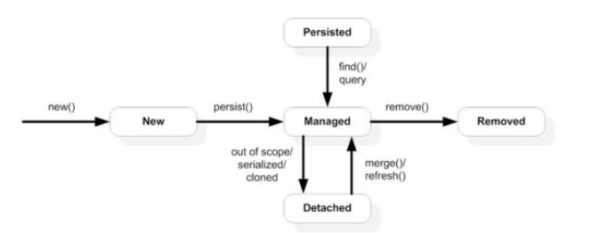

EntityManager - базовый интерфейс для работы с хранимыми
данными:
- Обеспечивает взаимодействие с Persistence Context.  

 Контекст сохранения транзакции привязан к транзакции. Как только транзакция завершится, сущности, присутствующие в контексте постоянства, будут сброшены в постоянное хранилище.
 
Когда мы выполняем любую операцию внутри транзакции, EntityManager проверяет контекст сохранения . Если он существует, то он будет использован. В противном случае это создаст контекст постоянства.
- Можно получить через EntityManagerFactory.
- Обеспечивает базовые операции для работы с данными (CRUD).

Основные метод :
1) Для операций над Entity: persist (добавление Entity под управление JPA, а именно PersistenceContext), merge (обновление), remove (удаления), refresh (обновление данных), detach (удаление из управление JPA), lock (блокирование Enity от изменений в других thread),
2) Получение данных: find (поиск и получение Entity), createQuery, createNamedQuery, createNativeQuery, contains, createNamedStoredProcedureQuery, createStoredProcedureQuery
3) Получение других сущностей JPA: getTransaction, getEntityManagerFactory, getCriteriaBuilder, getMetamodel, getDelegate
4) Работа с EntityGraph: createEntityGraph, getEntityGraph
5) Общие операции над EntityManager или всеми Entities: close, isOpen, getProperties, setProperty, clear.

~~### 3) Виджет на gwt, для оповещений в vk, Twitter (вроде как-то так звучал)~~

## Билет ? (10)

### 1) ajax в jsf

<f:ajax> можно указать листенера, который будет ловить евенты, можно указать, что отрендерить, можно указать, что отэкзекутить

```xhtml
 <f:ajax event="click" execute="newPointForm X hiddenR Y "
 render="X Y messageY pointsTable hiddenR b1 b2 b3 b4 b5"/>
```

### 2) Архитектура JPA

Матрешка. использует ормпровайдер, который использует ждбц, который использует ждбц драйвер, который ходит в базу.

EntityManagerFactory - This is a factory class of EntityManager. It creates and manages multiple
EntityManager instances.
EntityManager - It is an Interface, it manages the persistence operations on objects. It works like factory for
Query instance.
Entity - Entities are the persistence objects, stores as records in the database.
EntityTransaction - It has one-to-one relationship with EntityManager. For each EntityManager, operations
are maintained by EntityTransaction class.
Persistence - This class contain static methods to obtain EntityManagerFactory instance.
Query - This interface is implemented by each JPA vendor to obtain relational objects that meet the criteria.


### 3) Интерфейс авторизации(логин+пароль) на React. На стороне сервера - REST AP

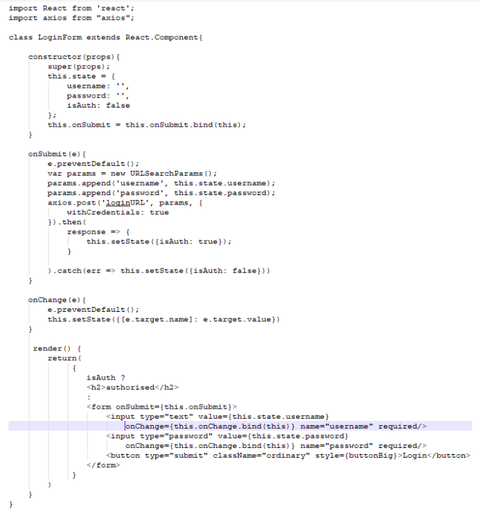

this.toggleState вызывается не в контексте класса и поэтому this - underfined -> поэтому биндим

## Билет ? (11)
### 1. Управляемые бины, конфигурация и что-то еще

- Содержат параметры и методы для обработки данных с компонентов, событий и валидации данных.
- Жизненным циклом управляет JSF Runtime Environment. Доступ из JSF-страниц осуществляется с
помощью элементов EL.  
- Для объявлении класса управляемым бином используется аннотация @ManagedBean(name =
«beanName», eager = «true\false»).  
name: указывает уникальное имя класса (бина) в JSF. Если имя не указано, то имя совпадает с
именем класса, где первая буква в нижнем регистре.  
eager: указывает на время создания бина. Если стоит true, то бин будет создан на старте
приложения, если false, то бин будет создан при первом запросе к нему.  

- faces-config.xml:

```xml
<managed-bean>
    <managed-bean-name>customer</managed-bean-name>
    <managed-bean-class>CustomerBean</managed-bean-class>
    <managed-bean-scope>request</managed-bean-scope>
    <managed-property>
        <property-name>areaCode</property-name>
        <value>#{initParam.defaultAreaCode}</value>
    </managed-property>
</managed-bean>
```


- аннотации:
```java
@ManagedBean(name="customer")
@RequestScoped
public class CustomerBean {
@ManagedProperty(value="#{initParam.defaultAreaCode}" name="areaCode")
private String areaCode;


}
```

### 2. JPA

jpa это спецификация для ORM-библиотек. а jdbc это стандарт. они нужны для работы с базами данных. jpa использует orm провайдер, которй использует ждбс, который испjльзует ждбц драйвер для доступа в базу данных. jpa позволяет абстрагироваться от особенностей жпа провайдера и писать универсальный код. увеличивается переносимость

~~### 3. Написать приложение на Vaadin, которое будет автомаически заполнять приказ об отчислении.~~

## Билет ? (12)
### 1. JMS. Модели доставки соотщений

Билет (?) 4

~~### 2. GWT. Основные преимущества и недостатки~~
### 3. Реализуйте CRUD-интерфейс к таблице Н_ВИДЫ_УЧЕБНОЙ_ДЕЯТЕЛЬНОСТИ с помощью Spring data

```java
@Entity
@Table(name = "country")
public class Country {

    @Id
    @GeneratedValue(strategy = GenerationType.IDENTITY)
    private int id;

    private String name;

    // далее идут get- и set-методы...
}
```
Spring Data предоставляет абстракцию CrudRepository, которая типизируется целевой сущностью и её id. CrudRepository имеет набор базовых методов для работы с сущностью, названия которых говорят сами за себя:

Нам достаточно расширить этот интерфейс, добавить сигнатуры необходимых нам методов и Spring автоматически создаст реализацию этого интерфейса!
```java
public interface CountryDao extends CrudRepository<Country, Integer> {

    List<Country> findAllByOrderByIdDesc();

    Country findByName(String name);
}
```

```java
@Service
public class CountryServiceImpl implements CountryService {

    @Autowired
    private CountryDao countryDao;

    @Override
    public List<Country> getAll() {
        return countryDao.findAllByOrderByIdDesc();
    }
}
```

## Билет ? (13)
### 1. Location Transparency, реализация в Java EE

Инфраструктура завязана на RMI (Java API, позволяющий вызывать методы удаленных объектов)

Благодаря CDI не важно, где физически расположен вызываемый компонент — за его вызов отвечает контейнер.

Клиент имеет прокси, обращается с ней как с нужным объектом. Прокси перенаправляет его вызовы куда следует: если нужный компонент находится локально, идёт к нему обращение по ссылке; если удалённо (в другой JVM) - необходима сериализация передаваемых данных.

принцип прозрачного нахождения. мы можем писать код не думая о том, где находится объект, его будет вызывать контейнер. для реализации в java ее нужно реализовать стаб на стороне клиента и скелетон на стороне сервера. Контейнер будет таскать объекты с помощью rmi
Для клиента создаётся видимость целостности приложения, как будто оно не распределено по разным серверам с разными JVM, то есть для использования Remote EJB ему не надо делать дополнительных движений. 

### 2. Rest в Spring. Spring RESTful

В спринг реализован rest путем RestController, все контроллеры, лежащие внутри класса, помеченного такой аннотацией будут автоматически сериализовать возвращаемые данные в JSON, так же можно указывать параметры в маппингах контроллеров, например @RequestMapping(“/get/{entity}”), которые можно получать вместе с запросом. Под коробкой такого веб приложения может лежать Spring MVC или WebFlux. Также в Спринге есть REST клиент в различных реализациях RestTemplate, WebClient

```java
package com.example.restservice;

import java.util.concurrent.atomic.AtomicLong;

import org.springframework.web.bind.annotation.GetMapping;
import org.springframework.web.bind.annotation.RequestParam;
import org.springframework.web.bind.annotation.RestController;

@RestController
public class GreetingController {

	private static final String template = "Hello, %s!";
	private final AtomicLong counter = new AtomicLong();

	@GetMapping("/greeting")
	public Greeting greeting(@RequestParam(value = "name", defaultValue = "World") String name) {
		return new Greeting(counter.incrementAndGet(), String.format(template, name));
	}
}
```

A key difference between a traditional MVC controller and the RESTful web service controller shown earlier is the way that the HTTP response body is created. Rather than relying on a view technology to perform server-side rendering of the greeting data to HTML, this RESTful web service controller populates and returns a Greeting object. The object data will be written directly to the HTTP response as JSON.

### 3. Создать бин, конфигурируемый аннотациями, с именем myBean, контекст которого равен контексту другого бина - myOtherBean

```java

@ManagedBean(name=”myOtherBean”)
@ApplicationScoped
class MyManagedBean {
	@ManagedProperty(value="#{myBean}")
    	private NeededBean neededBean;

    public NeededBean getNeededBean()    {
           return neededBean;
    }
    
    public void setNeededBean(NeededBean neededBean)    {
        this.neededBean = neededBean;
    }
}

```

```java
@ManagedBean(name=”myBean”)
@NoneScoped
class MyManagedBean {
	
}
```

## Билет ? (14)
### 1. Жизненный цикл Session beans


В плюс к этому ещё есть пулы экземпляров бинов. Так как клиенты обращаются к проксям, реализующим бизнес-интерфейс, а с реальными объектами бинов дел не имеют, с их жизненным циклом можно вытворять разные штуки. Вот что происходит для каждого из трёх видов сессионных бинов:

- Stateful - у каждого клиента своя прокси, ведущая на свой и только свой экземпляр бина, потому что клиенту важно состояние его бина
- Stateless - у каждого клиента один и тот же интерфейс, который каким-то образом уводит пользователя к одному из экземпляров бина из пула
- Singleton - единый интерфейс и единый экземпляр заставят вас поразвлекаться с concurrency

Аннотация @EJB служит для CDI и предоставляет клиентам не сам объект, а прокси, через который можно получить доступ к методам бизнес-интерфейсов. Может осуществляться доступ как к локальным, так и удаленным (в другой JVM) объектам.

### Жизненный цикл Stateless

- Не существует . В этом состоянии экземпляр компонента просто не существует.
- Готовое состояние . При первом запуске WebLogic Server создается несколько экземпляров компонента, которые помещаются в пул готовности. Контейнер может создавать больше экземпляров, если это необходимо для контейнера EJB.

#### Переход из состояния "не существует" в состояние готовности
Когда контейнер EJB создает экземпляр сеансового компонента без сохранения состояния для помещения в пул готовности, он вызывает метод обратного вызова public void setSessionContext (SessionContext ctx) . У этого метода есть параметр javax.ejb.SessionContext , который содержит ссылку на контекст сеанса, то есть интерфейс к контейнеру EJB, и может использоваться для ссылки на сам объект компонента сеанса. Полная информация о javax.ejb. SessionContext можно найти в вашей любимой документации J2EE и справочнике по API на http://java.sun.com .

После вызова метода обратного вызова setSessionContext контейнер EJB вызывает метод обратного вызова ejbCreate . Вы можете реализовать этот метод обратного вызова, например, для получения домашних интерфейсов других EJB, вызванных сессионным компонентом, как показано в разделе « Определение сеансового компонента» . Метод ejbCreate вызывается только один раз за время существования сеансового компонента и не привязан к вызову метода create клиентским приложением. Для сессионного компонента без сохранения состояния вызов createметод возвращает ссылку на экземпляр компонента, уже находящийся в готовом пуле; он не создает новый экземпляр компонента. Управление экземплярами сессионных компонентов без сохранения состояния полностью выполняется контейнером EJB.

#### Готовое состояние
Когда экземпляр компонента находится в состоянии готовности, он может обслуживать клиентские запросы; то есть выполнять методы компонентов. Когда клиент вызывает бизнес-метод, контейнер EJB назначает доступный экземпляр компонента для выполнения бизнес-метода. После завершения выполнения экземпляр сеансового компонента готов к выполнению другого бизнес-метода.

#### Переход от состояния готовности к состоянию несуществующего
Когда контейнер EJB решает уменьшить количество экземпляров сессионного компонента в готовом пуле, он подготавливает экземпляр компонента к сборке мусора. Непосредственно перед этим он вызывает метод обратного вызова ejbRemove . Если вашему сессионному компоненту необходимо выполнить какое-либо действие по очистке перед сборкой мусора, вы можете реализовать его с помощью этого метода обратного вызова. Метод обратного вызова не привязан к методу удаления, вызванному клиентом. Для сессионного компонента без сохранения состояния вызов метода remove делает недействительной ссылку на экземпляр компонента, уже находящийся в пуле готовности, но не перемещает экземпляр компонента из состояния готовности в состояние не существует, так как управление экземплярами сеансового компонента без сохранения состояния полностью выполняется контейнером EJB.

### Жизненный цикл Stateful

- Не существует . В этом состоянии экземпляр компонента просто не существует.
- Готовое состояние . Экземпляр компонента в состоянии готовности привязан к конкретному клиенту и участвует в диалоге.
- Пассивное состояние . Экземпляр компонента в пассивном состоянии пассивирован для экономии ресурсов.

#### Переход из состояния "не существует" в состояние готовности
Когда клиент вызывает метод create для сеансового компонента с отслеживанием состояния, контейнер EJB создает новый экземпляр и вызывает метод обратного вызова public void setSessionContext (SessionContext ctx) . У этого метода есть параметр javax.ejb.SessionContext , который содержит ссылку на контекст сеанса, то есть интерфейс к контейнеру EJB, и может использоваться для ссылки на сам объект компонента сеанса. Полная информация о javax.ejb. SessionContext можно найти в вашей любимой документации J2EE и справочнике по API на http://java.sun.com . После метода обратного вызова setSessionContextвызывается, контейнер EJB вызывает метод обратного вызова ejbCreate, который соответствует сигнатуре метода create .

#### Состояние готовности
Экземпляр bean-компонента с отслеживанием состояния в состоянии готовности привязан к конкретному клиенту на время его разговора. Во время этого разговора экземпляр может выполнять методы компонента, вызванные клиентом.

#### Активация и пассивация
Для более оптимального управления ресурсами контейнер EJB может пассивировать неактивный экземпляр сессионного компонента с сохранением состояния, переводя его из состояния готовности в пассивное состояние. Когда экземпляр сессионного компонента пассивируется, его (непреходящие) данные сериализуются и записываются на диск, после чего экземпляр компонента удаляется из памяти. Непосредственно перед сериализацией вызывается метод обратного вызова ejbPassivate . Если вашему сессионному компоненту необходимо выполнить некоторую пользовательскую логику перед пассивацией, вы можете реализовать ее с помощью этого метода обратного вызова.

Если после пассивации клиентское приложение продолжает диалог, вызывая бизнес-метод, пассивированный экземпляр bean-компонента повторно активируется; его данные, хранящиеся на диске, используются для восстановления состояния экземпляра компонента. Сразу после восстановления состояния вызывается метод обратного вызова ejbActivate . Если ваш сеансовый компонент должен выполнять некоторую пользовательскую логику после активации, вы можете реализовать ее с помощью этого метода обратного вызова. Вызывающая сторона (клиентское приложение или другой EJB) экземпляра сеансового компонента не будет знать о пассивации (и реактивации).

Если сессионный компонент с отслеживанием состояния настроен для использования алгоритма типа кеша NRU (не использовавшегося недавно), то время ожидания сеансового компонента может истечь в пассивном состоянии. Когда это происходит, он переходит в состояние не существует; то есть он удален. Перед удалением контейнер EJB вызовет метод обратного вызова ejbRemove . Если сессионный компонент с отслеживанием состояния настроен на использование алгоритма LRU (последний раз использованный), он не может истекать по тайм-ауту в пассивном состоянии. Вместо этого этот сессионный компонент всегда переводится из состояния готовности в пассивное состояние по истечении времени ожидания.

Точный таймаут можно установить с помощью атрибута idleTimeoutSeconds в аннотации @Session . Алгоритм типа кеша может быть установлен с помощью атрибута cacheType в той же аннотации.

#### Переход от состояния готовности к состоянию несуществующего
Когда клиентское приложение вызывает метод удаления для сессионного компонента с отслеживанием состояния, оно прекращает диалог и сообщает контейнеру EJB удалить экземпляр. Непосредственно перед удалением экземпляра контейнер EJB вызовет метод обратного вызова ejbRemove . Если ваш сессионный компонент должен выполнить некоторую пользовательскую логику перед удалением, вы можете реализовать ее с помощью этого метода обратного вызова.

Неактивный сеансовый компонент с отслеживанием состояния, настроенный для использования алгоритма типа кэш-памяти NRU (не использовавшийся недавно), может истекать по тайм-ауту, что переводит его в состояние не существует, то есть он удаляется. Перед удалением контейнер EJB вызовет метод обратного вызова ejbRemove . Если сессионный компонент с отслеживанием состояния, настроенный для использования алгоритма LRU (последний раз использовавшийся), истекает по времени, он всегда переходит в пассивное состояние и не удаляется.

Точный таймаут можно установить с помощью атрибута idleTimeoutSeconds в аннотации @Session. Алгоритм типа кеша может быть установлен с помощью атрибута cacheType в той же аннотации.

### 2. Jsx, особенности, применение в реакт

JSX — синтаксис, похожий на XML / HTML, используемый в React, расширяет ECMAScript, так что XML / HTML-подобный текст может сосуществовать с кодом JavaScript / React. Синтаксис предназначен для использования препроцессорами (т. е. транспилерами, такими как Babel), чтобы преобразовать HTML-подобный текст, найденный в файлах JavaScript, в стандартные объекты JavaScript. Примеры(с и без):
```javascript
function Button (props) {
 // Возвращает DOM элемент. Например:
 return <button type="submit">{props.label}</button>;}
// Отрисовываем компонент Button в браузере
ReactDOM.render(<Button label="Save" />, mountNode)


function Button (props) {
 return React.createElement(
   "button",
   { type: "submit" },
   props.label
 );
}
// Чтобы использовать Button вы должны написать что-то наподобие
// этого:
ReactDOM.render(
 React.createElement(Button, { label: "Save" }),
 mountNode
);

```
### 3. Написать правило навигации, для перехода с одной страницы на другую по нажатию кнопки

```xml
<navigation-rule>
	<from-view-id>index.xhtml</from-view-id>
    <navigation-case>
        <from-outcome>main</from-outcome>
        <to-view-id>main.xhtml</to-view-id>
        <redirect/>
    </navigation-case>
</navigation-rule>

```

## Билет ? (15)
### 1. Бизнес-логика, ejb, структура и классы. Локальные и удаленные что-то.

Пользователь хочет вызывать методы, но из-за того, что приложение может быть развёрнуто в разных JVM одновременно, контейнер должен иметь возможность управлять этими вызовами. Поэтому клиенту достаются не реальные объекты, а прокси, которые создаются контейнером и перенаправляют запросы куда надо. Чтобы контейнер знал, какие методы бина (класса, реализующего бизнес-логику, то есть Model из MVC) включать в прокси, нужен так называемый бизнес-интерфейс - интерфейс, содержащий объявления этих самых методов. Естественно, бин должен будет его реализовывать.
 
EJB делятся на два вида (есть и другие деления, о них позже): Local и Remote. Когда бин помечается как локальный, мы договариваемся с контейнером, что данный бин будет вызываться только в пределах одной JVM, то есть его можно будет использовать по ссылке и ничего не придётся сериализовывать, что неплохо ускорит работу приложения. Раз уж на то пошло, то для локальных бинов даже необязательно делать бизнес-интерфейс, если пометить его аннотацией @LocalBean. А вот Remote бины имеют все прелести RMI: передачу по значению а не по ссылке, а значит нужна сериализация + обязательны бизнес-интерфейсы. 

1. Bean has a @LocalBean annotation -> bean has a no-interface view
2. Bean has a @Local annotation -> bean has a local view
3. Bean has a @Remote annotation -> bean has a remote view
4. Bean has no view annotations, but directly implements an interface which has a @Local annotation -> bean has a local view
5. Bean has no view annotations, but directly implements an interface which has a @Remote annotation -> bean has a remote view
6. Bean has no view annotations, but directly implements an interface which has no view annotations -> bean has a local view
7. Bean has no view annotations, and implements no interfaces -> bean has a no-interface view

Также EJB делятся на Session и Message-Driven. Вызов методов первых происходит напрямую, а вторых - по возникновению событий и только так (типа один большой бин-слушатель). MDB нас особо не интересуют.

Session бины делятся на Stateful, Stateless и Singleton. Весьма очевидно из названий в чём их особенности, но если не слишком, то чекайте 

### 2. SPA

Одностраничное приложение - приложение, которое фактически содержит только одну html страницу и несколько разных представлений, подгружаемых динамически. 
- экономит трафик
- переносит часть нагрузки с серверов на клиента 
- спасает клиента от сбоев в сети 
- использует browser history api для переадресации и кнопочки назад. 
- может работать в оффлайн режиме
- быстрый отклик (подражаение десктопным приложениям)
- богатый пользовательский интерфейс, так называемый User Experience. Так как web-страница одна, построить богатый, насыщенный пользовательский интерфейс гораздо проще. Проще хранить информацию о сеансе, управлять состояниями представлений (views) и управлять анимацией (в некоторых случаях).


#### Минусы

- Долгая первая загрузка
- Нет поддержки javascript == нет приложения
- SEO
- Большая часть взаимодействия на клиенте

### 3. Что-то с БД, JPA Criteria api. Найти всех студентов со средним баллом ниже 4.0 и удалить

Criteria API - это когда вместо sql-подобных запросов в виде строки делается серия вызовов методов строителя запросов, определяющих новый запрос.

```java

@Stateless
@LocalBean
public class StudentManagement {
    @PersistenceContext
    private EntityManager em;

    public void deleteStudents() {
        CriteriaBuilder cb = em.getCriteriaBuilder();
        CriteriaDelete<Student> delete = cb.createCriteriaDelete(Student.class);
        Root e = delete.from(Student.class);
        delete.where(cb.lessThan(e.get("avgGrade"), 4.0));
        this.em.createQuery(delete).executeUpdate();
    }
}

```

## Билет ? (16)
### 1. stateless stateful singleton session bean. Сходство отличия итп

Stateful ассоциируются с конкретным пользователем + могут уходить в спячку (с возможностью умереть по достижении тайм-аута) чтобы ждать возвращения пользователя. Посему у каждого юзера своя прокси на свой ejb. 

Stateless могут менять обслуживаемых пользователей, поэтому в них не надо хранить состояние (хоть никто и не запретит). Благодаря такой особенности, нагрузку на сервера проще распределить между юзерами.

Stateless or Singleton:

Я бы выбрал Stateless - сервер может генерировать множество экземпляров bean-компонента и обрабатывать входящие запросы параллельно.

Синглтон звучит как потенциальное узкое место - значение @Lock по умолчанию - @Lock (WRITE), но может быть изменено на @Lock (READ) для компонента или отдельных методов.


@Stateless позволит вам иметь несколько копий, готовых для обработки в JVM (столько, сколько позволяет память и размер пула), где, как @Singleton, в JVM есть только одна копия, даже если одна может поддерживать несколько параллельных потоков, работающих против нее.

С точки зрения производительности @Singleton было бы лучше, при условии, что используемые ресурсы позволяют длительный доступ. Однако в распределенной среде иногда происходят плохие вещи, например, могут выйти из строя ссылки базы данных или сети.

С @Stateless бином доступ более недолговечный. Кроме того, в случае сбоя он просто возродится и попытается установить новое соединение с ресурсом. Если что-то подобное происходит с синглтоном, то синглтон должен обработать его, не требуя перезапуска приложения, потому что @PostConstruct вызывается только один раз для каждой JVM.

Я бы предпочел немного отказоустойчивости по сравнению с производительностью в большинстве ситуаций, особенно в системах, которые я не контролирую.

### 2. компоненты react. Что такое итп. Умные и глупые компоненты

#### Глупые компоненты:
- не зависят от остальной части приложения, например Flux actions или stores
- часто содержатся в this.props.children
- получают данные и колбэки исключительно через props
- имеют свой css файл
- изредка имеют свой state
- могут использовать другие глупые компоненты
- примеры: Page, Sidebar, Story, UserInfo, List

#### Умные компоненты:
- оборачивает один или несколько глупых или умных компонентов
- хранит состояние стора и пробрасывает его как объекты в глупые компоненты
- вызывает Flux actions и обеспечивает ими глупые компоненты в виде колбэков
- никогда не имеют собственных стилей
- редко сами выдают DOM, используйте глупые компоненты для макета
- римеры: UserPage, FollowersSidebar, StoryContainer, FollowedUserList

А теперь мои умные и глупые:  
Умные - могут изменять данные  
Глупые - не могут

### 3. jsf поле многострочного ввода в которое можно ввести только строчные английские буквы

```xhtml
<h:inputTextArea> <f:validateRegex pattern =”^[a-z]+$”/></h:inputTextArea>
```


# Видео по Spring:

1) Мы за SIngle Responsibility и за принцип разделения интерфейсов, поэтому все выносим в отдельные интерфейсы  
    Инициализируем реализации интерфейсов Announcer и Policemen в ПОЛЯХ класса CoronaDesinfector
    ```java
    private Announcer announcer = new ConsoleAnnouncer(); 
    ```

2) У CoronaDesinfector в итоге не single responsibility, а много responsibility (>7), так как мы отвечаем за создание объектов классов (которые в полях)  
    Выбираем реализацию нужную нам

3) Пилим Factory, который создавал бы объекты за нас
    ```java
    private Announcer announcer = ObjectFactory.getInstance().createObject(Announcer.class); 
    ```
4) в Factory в методе createObject выбирается нужная реализация на основании класса Config, который будет сканировать пакеты

5) в Config есть map с реализациями, если там содержится нужный интерфейс и реализация, пакеты еще раз сканироваться не будут

6) Объект мы создали, но нужно ведь и настроить (вдруг в классе есть fields, которые нужно заинжектить (из файлов конфигов, к примеру))

7) Для настройки объекта используется анализ огромного количества аннотаций (куча if'ов). Поэтому для каждой аннотации свой конфигуратор. Класс ObjectFactory за настройку объекта отвечать не должен   
    А в Factory будет храниться лист конфигураторов

8) Это не инверсия контроля, это lookup
   ```java
   private Announcer announcer = ObjectFactory.getInstance().createObject(Announcer.class); 
   ```
   Мы создаем фабрику каждый раз, мы дергаем статиеский метод getInstance() и делаем это каждый раз, когда нужно что-то создать
      -> нужен синглтон (кэшировать синглтоны). 
      
9) Домашние синглтоны это плохо, так как одни синглтоны могут юзать другые. Сервису A нужен сервис B, cервису B - сервис C и все они будут юзать getInstance()  
   Все домашние синглтоны между собой связаны статическими методами, хрен, что подложишь, хрен. что подменишь
   Синглтон это классно, но реализовывать его плохо. Нужно кешировать синглтоны! юзая Context
   
10) Мы не инициализируем Announcer и Policemen сами, мы юзаем аннотацию @InjectByType и просим конфигуратор InjectByTypeObjectConfigurator все сделать (проинициализировтаь за нас)  
    Конфигуратор и main могут юзать getInstance() у фабрики, это норма

11) Фабрика в конструкторе получает Context

12) PostConstruct прогоняется в Factory, так как это вторичный конструктор и это логично. а Ordering у конфигураторов это плохо

13) Хочется добавить что-то в метод объекта Recommendator, видоизменив поведение. Proxy Pattern используется для этого. Фабрике будет пох, так как интерфейс общий
    -> новый конфигуратор -> еще один лист конфигураторов в фабрике (ProxyConfigurator)

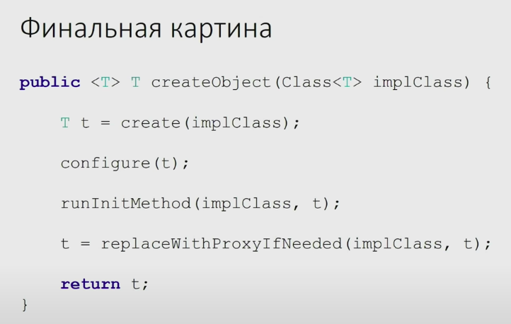

# Важное отличие Spring от Java EE:

В Spring есть Runtime. Получается RunTime управляет компонентами. Умный RunTime собирает все вместе и управляет сервером.

А в EE сервер приложений управляет RunTime. Мы говорим серверу приложений, что мы хотим, чтобы он сделал 

DI работает похожим образом, но в Spring мы имеем более гибку конфигурационную тему 

А в EE ориентация не на конфигурацию и хитрую компоновку приложения, а на то, что у нас умный RunTime = сервер приложений и сервер приложений обеспечивает рзные полезные фишечки

в EE менее удобная конфигурация, но зато, если мы запилили кластер, приложене по нему размажется. Просто потому что кластер провайдится Application сервером и он у руля (все приложение хостится на Application Server). Нет внешней по отношению к серверу конфигурации, которая им управляет 

В EE можно использовать Remote для бинов прозрачно через аннотацию

В построение Spring приложения - трехфазовый конструктор. На объекты в любом случае накладываются срезы


--BeanFactoryPostProcessor--

1) Конструктор Java

--BeanPostProcessor--

AutowiredBeanPostProcessor 

2) @PostConstruct сеттятся все поля (все бины перерабатываются и отрабатываются @Autowired и прочие прочие прочие аннотации, под которые написаны обработчики этих аннотаций), -> все бины лежат в мапе бинов и готовы к действию

--BeanPostProcessor

3) event у Spring ApplicationContextRefreshed: 
- порождение Proxy объекта для бинов.
- Запихивание наших бинов внутрь Proxy объектов 
- наращивание срезов (аспектов) на начало/конец вызова метода

Spring Framework активно использует BeanPostProcessor для проксирования и др., поэтому, если вам необходима поддержка такой функциональности, как AOP и транзакций, то при использовании BeanFactory необходимо добавить вручную регистрацию BeanPostProcessor и BeanFactoryPostProcessor, как показано ниже:

 
## Пока плохо:
- 3 билет ORM
- 3 билет автодополнение React  
~~- 13 билет ЖЦ spring- приложения~~
- Аннотация Resource
Разница между @Inject, @Autowire и @Resource?

@Autowired: аннотация Spring (в отличие от @Inject и @Resource), которая вводит ресурс по типу, то есть по классу интерфейса аннотированного поля или подрядчика. Если у нас мало реализаций интерфейса или подкласса, мы можем сузить выбор с помощью аннотации @Qualifier, чтобы избежать двусмысленности. Для резервного совпадения имя bean-компонента считается значением квалификатора по умолчанию. Хотя вы можете использовать это соглашение для ссылки на конкретные bean-компоненты по имени, @Autowired в основном относится к инъекции, управляемой типом, с дополнительными семантическими квалификаторами.

@Inject:Аннотация на основе JSR-330 (внедрение зависимостей для Java) определяет вводимые конструкторы, методы и поля. Эта аннотация является почти полной заменой аннотации Spring @Autowired. Таким образом, вместо использования аннотации @Autowired, специфичной для Spring, вы можете использовать @Inject. Одно из различий между @Autowired и @Inject заключается в том, что @Inject не имеет обязательного поля, поэтому, если мы не сможем найти подходящий объект для инъекции, он потерпит неудачу, в то время как @Autowired может использовать required = false и разрешить пустое поле (только если необходимо!). Преимущество аннотации @Inject в том, что вместо того, чтобы напрямую вводить ссылку, вы можете попросить @Inject внедрить Provider. Интерфейс Provider позволяет, среди прочего, ленивую инъекцию ссылок на bean-компонент и внедрение нескольких экземпляров bean-компонента. Если у нас мало реализаций интерфейса или подкласса, мы можем сузить выбор, используя аннотацию @Named, чтобы избежать двусмысленности. @Named аннотация работает так же, как Spring @Qualifier

@Resource: аннотация на основе JSR-250. @Resource очень похож на @Autowired и @Inject, но основное различие заключается в путях выполнения, используемых для определения необходимого bean-компонента для внедрения. @Resource сузит поиск сначала по имени, затем по типу и, наконец, по квалификаторам (игнорируется, если совпадение найдено по имени). @Autowired и @Inject сузят поиск сначала по типу, затем по квалификатору и, наконец, по имени.

Их единственное различие заключается в их назначении, т.е. @Controller используется в Spring MVC для определения контроллера, который является сначала компонентом Spring, а затем контроллером. Точно так же @Service используется для аннотированных классов, которые содержат бизнес-логику на уровне сервиса, а @Repository используется на уровне доступа к данным.

Read more: https://javarevisited.blogspot.com/2017/11/difference-between-component-service.html#ixzz6jE8nybWX

- Билет (?) (6) Ioc DI в Spring


